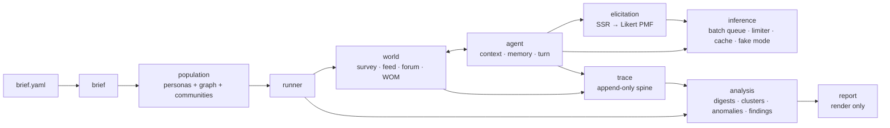
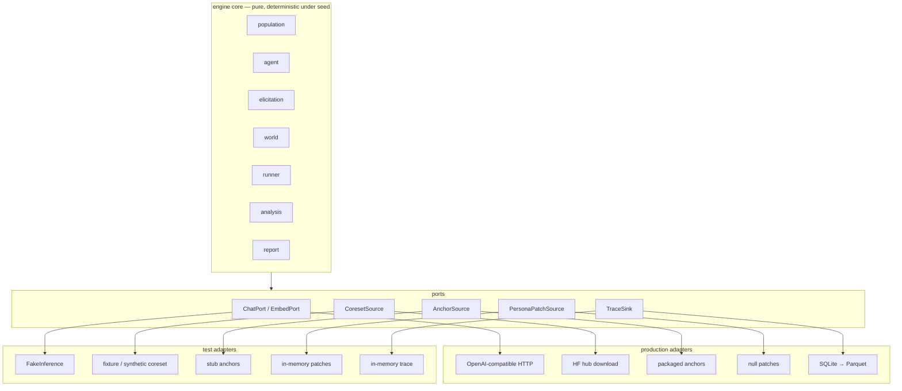

# ConsumerSim — Engine Architecture

**Scope:** the open-source simulation engine, implementation only. No business, market, positioning, pricing, or tiering content — this document is what you build from.
**Language/runtime:** Python 3.12+, `uv`-managed.
**License:** Apache-2.0 (matches upstream OASIS and ASAL).
**Salvage sources:** [OASIS](https://github.com/camel-ai/oasis) (Apache-2.0), [ASAL](https://github.com/SakanaAI/asal) (Apache-2.0), [MatrAIx-Persona-8B](https://github.com/MatrAIx-ai/MatrAIx-Persona-8B) (MIT) + HF dataset `MatrAIx2026/MatrAIx_Persona_1M`.
**Companion documents:** `CONTEXT.md` is the project glossary and is authoritative on naming — where a word here disagrees with it, the glossary wins. `docs/adr/` records decisions whose reasoning would otherwise be invisible in the code. `docs/prd/` and `plans/` carry per-module requirements and phasing.

---

## 1. What the engine does

A product brief goes in. A population is sampled from a real 1,290-attribute persona dataset and given a social structure. Those personas are run through interacting environments — survey room, social feed, forum, word-of-mouth — where they see each other's behavior. Purchase intent is elicited as free text and converted to a Likert distribution by embedding similarity, never by asking a model for a number. Everything that happens is written to an append-only trace. A report is derived from that trace, and no claim renders without resolving to trace IDs.



---

## 2. Architectural principles

These are the rules that decide where code goes. They are binding; §13 records where the design previously violated them and what changed.

**P1 — Deep modules.** A module earns its existence by hiding more than it exposes. If a module's interface is about as complex as its implementation, it should be part of its only caller. Measured concretely: a module with one caller and an interface of 3+ parameters carrying intermediate types is a merge candidate, not a module.

**P2 — No orphan intermediates.** A type that exists only to travel between two modules, and that no external caller ever wants on its own, is evidence the boundary is in the wrong place.

**P3 — One owner per invariant.** Every cross-cutting rule (budget, persona conditioning, provenance, trust) has exactly one module that owns and enforces it. Rules enforced in three places are enforced in none.

**P4 — Ports at every non-deterministic boundary.** Anything with network, filesystem, clock, or model non-determinism is reached through a port with at least two adapters: the real one and an in-memory one used by tests. This is what makes deep modules testable without mocking internals.

**P5 — Boundary tests are the primary test layer.** Property tests guard data invariants; golden runs detect drift. Correctness is asserted at deep-module boundaries, against observable outputs, using in-memory adapters.

**P6 — Salvaged code stays diffable.** Forked OASIS files keep upstream file structure and license headers so quarterly upstream diffs remain mechanical. Salvage is isolated behind our own port so upstream shape never leaks into engine-wide interfaces.

---

## 3. Module map

Twelve modules. Every one is either a leaf contract, a deep behavioral module, or a thin adapter over salvaged code.

| # | Module | Owns | Hides | Interface |
|---|---|---|---|---|
| 1 | `schemas` | every type crossing a module boundary | nothing (leaf, zero logic) | types + validators |
| 2 | `brief` | intake, category ontology, assumption ledger | YAML parsing, evidence fetching, ontology versioning | `load_brief(path, ontology_dir) -> BriefPack` |
| 3 | `population` | who is in this study and how they are connected | 4-bit decode, conditioning filter, postings filter, audience-proportional sampling, distribution gates, sparse completion, graph generation, Leiden community detection | `build(brief, n, population_seed) -> Population` |
| 4 | `inference` | every model call in the system | provider routing, retries, coalescing, caching, token accounting, model pinning, fake mode | `chat(role, msgs) -> Completion`, `embed(texts) -> Vectors` |
| 5 | `elicitation` | free text → Likert PMF (SSR) | anchor sets, reference-set averaging, τ, non-collapse checks | `score(text) -> SsrResult` |
| 6 | `agent` | one persona's reaction to one impression | context assembly, persona conditioning, memory retrieval, reflection, tier routing, output parsing, guardrails | `turn(persona, impression, view) -> Reaction` |
| 7 | `world` | environment mechanics and who sees what | platform state, action handling, recsys ranking, activation clock, interventions | `reset(header) -> WorldDelta`, `step(tick, turns) -> WorldDelta` |
| 8 | `runner` | executing a study within a budget | job expansion, worker pool, checkpointing, resume, budget governance and its enforcement, sweep | `run(RunConfig) -> RunResult` |
| 9 | `trace` | the append-only record and its read views | SQLite→Parquet lifecycle, partitioning, registry, query shapes | `write(events)`, `view(run_id) -> TraceView` |
| 10 | `analysis` | deriving meaning from a trace | digest computation, verbatim clustering, anomaly detection, finding authorship, trust guard | `digest(view) -> OutcomeDigest`, `findings(views) -> list[Finding]` |
| 11 | `report` | rendering | templates, markdown/JSON parity | `render(findings, digests) -> Report` |
| 12 | `cli` | entrypoints | argument plumbing, exit codes | `coreset-gate`, `ssr-replica`, `concepts run`, `sweep run` |

### Mapping from the previous 28-module numbering

Kept so the salvage inventory and any existing notes stay resolvable.

| Old | New home | Old | New home |
|---|---|---|---|
| M1 | `schemas` | M15 | `world` |
| M2 | `brief` | M16 | `runner` |
| M3, M4, M5, M6 | `population` | M17 | `runner` (budget, single enforcement point) |
| M7 | `inference` | M18 | `inference` (cache folded in) |
| M8, M10, `ContextBuilder` | `agent` | M19 | `trace` |
| M9 | `elicitation` | M20 | `runner` (sweep) + `analysis` (digest) |
| M11 | deferred (§12) | M21–M23 | deferred (§12) |
| M12, M13, M14 | `world` (RetailShelf deferred, §12) | M24, M25 | `AnchorSource`/`PersonaPatchSource` ports + deferred harness (§12) |
| — | — | M26 | deferred (§12) |
| — | — | M27 | `analysis` (authorship) + `report` (render) |
| — | — | M28 | `cli` |

---

## 4. Ports and adapters

Six ports. Each has a production adapter and an in-memory adapter; the in-memory one is what every boundary test runs against.

| Port | Production adapter | Test adapter | Why it's a port |
|---|---|---|---|
| `ChatPort` / `EmbedPort` | one OpenAI-compatible endpoint over `httpx` — a user-run gateway (LiteLLM by default) or vLLM/Ollama directly; no provider SDK (ADR 0021) | `FakeInference` — deterministic completions keyed by prompt hash | network + model non-determinism |
| `CoresetSource` | `HfCoresetSource` — reads shards a user fetched explicitly, verifying every file against `manifest.json` on each use; downloads nothing | `FixtureCoresetSource` (committed rows), `SyntheticCoresetSource` (generated; its fields state a tier — a shape that declares no assignment type is measured, one standing for a model's reading is extracted, for invented rows synthesized) | filesystem + a 4.17 GB dependency that must not be bundled, and a decoder whose rules are the dataset's knowledge |
| `CoresetCatalog` | `IndexCoresetCatalog` — coverage and counts answered from postings built once from the cached shards' packed arrays and saved beside the cache, never a row decode (the release's own 2.6 GB `postings.sqlite` is not used) | the same `SyntheticCoresetSource`, which implements both protocols | a four-orders-of-magnitude cost gap and a different failure mode are why `preview()` is typed to the catalog, not the source, so it cannot grow a row read |
| `AnchorSource` | `PackagedAnchors` — versioned anchor sets and default τ shipped in-repo | `StubAnchors` — fixed vectors, exact expected PMFs | lets anchors and τ be replaced without touching `elicitation` |
| `PersonaPatchSource` | `NullPatchSource` (ships as default) | `InMemoryPatchSource` | lets externally-derived persona corrections be applied without changing `population`'s signature later |
| `TraceSink` | `SqliteParquetSink` | `InMemoryTraceSink` | filesystem + a hot write path |
| `EvidencePort` | `HttpEvidence` — a standard-library GET, http(s) only, capped and timed out | `InMemoryEvidence` — url to bytes, with failures on demand | network, and the only reach outside the engine that a study author triggers |

Two of these are load-bearing beyond testability:

**`CoresetSource` and `CoresetCatalog` are the dataset-independence seam.** The engine never requires the 1M-row dataset to be present or bundled, and it never fetches a shard on a user's behalf: `HfCoresetSource` reads a cache the user populated with an explicit `hf download`, and refuses an absent shard with the exact command that fetches it, verifying every cached file against the manifest's digest on each use (ADR 0016, ADR 0020). `SyntheticCoresetSource` makes `concepts run --fake` work end-to-end with zero downloads and zero API keys, which is the quickstart path. `preview()` is typed to `CoresetCatalog`, not `CoresetSource`, so a pre-flight that only needs counts cannot read a row. Nothing in the engine may import a dataset file path directly — it goes through a port.

**`AnchorSource` and `PersonaPatchSource` are the calibration seams.** The engine ships defaults (a documented default τ, no patches). If anchors, τ, or persona corrections are later derived from real human data, they arrive as a different adapter — no change to `elicitation` or `population` signatures. Designing these in now is cheap; adding them after the interfaces are public is a breaking change.



---

## 5. Module specifications

Each spec states what the module **owns**, what it **hides**, its **interface**, its **internals**, its **salvage**, and its **boundary tests**.

### 5.1 `schemas` — contracts

**Owns:** every type crossing a module boundary, and the invariants that are true of the data by definition.
**Hides:** nothing. This is a leaf.
**Hard rule:** imports nothing from `simcore`, and only `pydantic` (with its own `pydantic-core` engine) + stdlib from outside. No numpy, no pyarrow, no networkx. If `schemas` needs a project import, a type is in the wrong file.

**Interface:** ~40 frozen pydantic v2 models with `extra="forbid"`, `allow_inf_nan=False`, and immutable containers only — tuples, frozensets and `FrozenDict`; list, dict and set annotations are refused at class definition, and `model_copy(update=...)` re-validates — grouped one file per domain — `brief`, `persona`, `population`, `sim`, `run`, `trace`, `report`, `enums`, `errors`, `base`.

**Load-bearing validators:**
- `PMF5` — 5 values, all strictly `> 0`, sum ∈ [0.999, 1.001]. Strict positivity because polarization is a JSD across community PMFs and downstream metrics are KL-family; SSR's softmax cannot emit an exact zero, so a zero means something upstream is broken.
- `ModelPins` — rejects empty, wildcarded and version-floating ids, including `-latest`, `:latest` and `@latest`. This is what makes replayability structural rather than aspirational.
- `Finding` — distinct supporting records and a non-empty disconfirming test. Makes an unprovenanced or auto-crowned claim unconstructible.
- `TrustStatement` — any level above `UNCALIBRATED` needs a `CalibrationRef` pinning its benchmark and human study by hash, with measured similarity and rank attainment at or above 0.80 (ADR 0008); nothing in the repository produces one.
- Computed values — gate verdicts, the SSR headline mass, whether an exposure was noticed, digest metrics, and every identity hash — serialize but are never trusted on input: a supplied value that disagrees with the computation is refused.
- Invariants that span records are enforced by the aggregate that holds them, never by a record labelling itself: `Population` checks conditioning, field domains, baseline beliefs and gate grounding against the brief pack; `Turn` checks a reaction is about something shown; `TracePartition` checks claims, stimuli, personas and pins against its header; `Report` checks digests and anomalies against its run configuration.

**Canonical hashing** (`base.py`): dump the model with `mode="json"`, then walk that dump alongside the live model so each nested model's `_hash_exclude_` and `_hash_version_` apply at its own depth — a single top-level `exclude` silently ignores nested declarations. Set-valued fields are sorted (their iteration order depends on the process hash seed), negative zero becomes zero, and the contract version is folded under `_schema_version`, a key pydantic will not let any field occupy. The result is hashed as `sha256(json.dumps(payload, sort_keys=True, separators=(",",":"), allow_nan=False))`; `sort_keys` is required because insertion order must not move a hash. `mode="json"` means enum *member* renames don't move hashes, only value changes do. Four hashes: `brief_hash`, `population_hash`, `config_hash` (includes `SCHEMA_VERSION`), `graph_hash`. Each is derived from its object — the population hash from its brief, ontology, seed, personas, graph and communities; the graph hash from its ties — and stated only where the object itself does not travel, then verified wherever it is present (ADR 0009). The representative study's identities are pinned per contract version, so a hashed shape cannot change without a version bump.

**Performance rule:** pydantic guards boundaries, not inner loops. Three paths use `model_construct` — which refuses raw mappings wherever a field expects a model, so a mistake fails at construction rather than far downstream — and are validated only in fake-mode CI: trace writes (~500k events/world), graph adjacency (~100k edges), per-row coreset decode. Embeddings never live inside a model — `EmbeddingRef {model_id, dim, index}` points into one contiguous `float32` array per population.

**Boundary tests:** round-trip property tests per type (hypothesis); committed hash-stability golden fixtures; one test per validator; an AST test asserting the leaf rule holds; a forward-compat test that a trace partition written under an older contract version still loads.

---

### 5.2 `brief` — intake

**Owns:** turning user YAML into validated structures, the category ontology, and the assumption ledger.
**Hides:** parsing, strict-mode rejection, claim ID assignment, evidence-URL fetch and hashing, ontology file versioning.

**Interface:** `load_brief(path: Path, ontology_dir: Path) -> BriefPack` · `fetch_evidence(path: Path, port: EvidencePort, *, refetch: bool = False) -> FetchReport` · `assumptions_of(pack: BriefPack) -> tuple[Assumption, ...]`

**Internals:** `yaml.safe_load` → `ProductBrief.model_validate` (unknown keys rejected); claim IDs auto-assigned `C1..Cn` and never authored; a claim cites `evidence_url` and the content hash beside it comes from `<brief>.evidence.json`, written by a separate `fetch_evidence` command through `EvidencePort` — loading touches no network and no clock, and a cited URL that was never fetched is refused (ADR 0013); the brief names an ontology version and the category ontology is loaded as versioned JSON from `ontology_dir` — never embedded in the brief (ADR 0004) — then joined into a `BriefPack` that refuses a category or version mismatch and checks audience filters against the ontology; the ontology declares a field domain for every attribute it uses, and supplies an attribute relevance order (every declared attribute ranked once, the conditioning set first, so a token budget cuts only non-conditioning attributes), the anchor set for each construct, and `completion_policy` (which persona fields may be synthesized — economics, decision rules, media yes; demographics, psychographics never); stimulus kinds are one global closed set, not a per-category list; assumption ledger built so every assumption is a first-class record surfaced in the report.

**Gotcha to encode:** claims are the atomic stimulus unit — feed cards, forum posts and report findings all reference `Claim.id`. Reordering claims mid-study silently breaks comparability, which is why `brief_hash` covers claim order and the runner refuses to resume a run whose `brief_hash` moved. And because the ontology is the study's claim about what a category is, its conditioning set must be checkable against a real source — `population.preview` answers that from the catalog's coverage, so an ontology that names a conditioning attribute nobody carries fails at authoring, not at the end of the first draw (ADR 0020).

**Boundary tests:** malformed YAML rejected with a `GateFailure`, not a stack trace; unknown keys rejected; claim IDs stable and contiguous; `brief_hash` invariant to comment/whitespace changes and sensitive to claim reordering.

---

### 5.3 `population` — who is in the study

*Absorbs old M3 (loader), M4 (sampling), M5 (projection), M6 (graph).*

**Owns:** producing the complete population for a study — personas, their social graph, their communities, and the report that says whether the sample is acceptable.
**Hides:** packed-4-bit decode, null-bitmask and codebook semantics, `attribute_overrides` precedence, postings-index filtering, conditioning-set filtering, audience-proportional sampling, categorical and ordinal distribution gates, sparse completion via the model, embedding computation, two-layer graph generation, Leiden community detection, community-card authoring.

**Interface:** the pre-flight has two stages (ADR 0020) — `preview` answers what the corpus holds from an index, `assess` answers whether a draw is sound from rows:

```python
def preview(request: PreviewRequest, *, catalog: CoresetCatalog) -> AudiencePreview

def assess(pack: BriefPack, n: int, population_seed: int, *,
           coreset: CoresetSource,
           parameters: PopulationParameters = PopulationParameters()) -> GateReport

def build(pack: BriefPack, n: int, population_seed: int, *,
          coreset: CoresetSource, inference: ChatPort,
          patches: PersonaPatchSource = NullPatchSource(),
          embed: EmbedPort | None = None,
          parameters: PopulationParameters = PopulationParameters()) -> BuiltPopulation

def interpret_audience(description: str, pack: BriefPack, *,
                       catalog: CoresetCatalog, inference: ChatPort) -> Audience
```

`preview` is typed to `CoresetCatalog` — a separate port from `CoresetSource`, answering `coverage(attributes, sources)` and `count(predicates, present)` from a per-value index, never by decoding a row — because the two answers differ by four orders of magnitude in cost and typing `preview` to a source is how it would eventually grow a row read. `SyntheticCoresetSource` implements both; `IndexCoresetCatalog` is built from `HfCoresetSource`'s packed arrays without decoding a persona. `interpret_audience` turns words into predicates through `ChatPort`, bounded by the coverage table (ADR 0014). `assess` stops after gating and calls no model, so checking a cohort is free; `build` returns a `BuiltPopulation`: the validated `Population` — `personas`, `graph`, `communities`, `gate_report`, `manifest` (row ids, requested and achieved mix, seeds, completion provenance, `admissible_sources`, `population_hash`) — alongside the embedding array when embeddings are enabled. The array travels beside the contract, never inside it: `schemas` is a leaf package and can hold no numpy, and a hash over 2,000 × 384 floats would dominate every serialization in the system. `EmbeddingRef.index` is the join.

Sampling, graph rewiring and community detection draw from **independent streams** spawned off the one population seed (`SeedSequence(population_seed).spawn(3)`) rather than from separately authored seeds, which would invite correlated draws if anyone set them equal (ADR 0001). Leiden is randomised, so it is seeded too. A population is built once and carried, never rebuilt: determinism holds under a deterministic inference port, and against a live model the completion of sparse fields makes a rebuild a different population (ADR 0015).

**Why these four merged:** nobody ever wants a `DecodedRow` — it existed only to cross a boundary. Field-mapping knowledge was split between decode and projection. The completion policy was defined in `brief` but enforced in projection. The graph is not a separate concept from the population; a population without its social structure is not usable by any caller. One module, one question: *who is in this study?*

**Internals, in order:**
1. **Resolve** — intersect postings sets per filter key **and require every attribute in the category's conditioning set to be populated**; index-only, never opens a data shard. Filtering for conditionability here rather than dropping sparse rows after sampling is what stops the population skewing toward the dataset's complete synthetic rows (ADR 0002).
2. **Decode** — `ports/decoder.py`, proven against a generated parquet, never a committed row (ADR 0016). Codes are 4-bit, **indexed from zero, two to a byte, low nibble first** (`code_base: 0`); the **null bitmap is the sole authority on presence** — a set bit means missing, LSB-first — and **an absent bitmap means fully populated**, which is how the 400,000 synthetic rows survive at all; **`attribute_overrides` supersede the code** unconditionally, are out of vocabulary without exception, and are folded: structured missingness (`null`, `Not applicable`) → absent, a real value the enum cannot express (`65+`) → absent, never admitted raw or guessed into a band, because the gates and filters rest on a closed vocabulary and a demographic is never synthesized — and counted as unexpressible in coverage and the preview, since the loss follows the value. The vocabulary is consulted before the missingness sentinels. The decoder checks its own output against the corpus's `populated_attribute_count` — equal to the bitmap present-count, not the non-zero-code count — and fails loudly on a mismatch, naming the row. Eligibility reads the same decoded labels, so an override that folds a conditioning field to absent can never slip into a persona.
3. **Sample** — seeded `np.random.Generator`; quotas from the shares the brief's audiences declare (all-or-nothing, summing to one); a brief declaring no audiences draws uniformly from the eligible pool, and its gates then judge the draw against the category's measured targets where the ontology carries them. `admissible_sources` — a recorded `PopulationParameters` field, on the manifest, never read from the environment — restricts which sources a study may draw from; a row outside them never enters the sample, and reaching a quota by admitting a weaker source is a choice the preview shows before the draw. A quota that cannot be filled climbs a fixed ladder, each rung recorded as a `Relaxation` on the gate report: widen an ordinal predicate by one band, then drop the least relevant non-conditioning filter using the ontology's `relevance_order`, then accept the shortfall so the achieved mix tells the truth, and fail only when an audience matches nothing (a `preview` reports that ladder's rungs without drawing a sample). The conditioning set is never a rung — trading it for coverage would undo ADR 0002.
4. **Gate** — a tagged union, never nullable twins: `CategoricalGate` on categorical marginals (χ², pass at p > 0.05) and `OrdinalGate` on attributes the ontology declares ordinal, using their band→midpoint scale (pass at `ks_similarity ≥ 0.80`, where `ks_similarity = 1 − D` — named for direction, because a threshold on a bare `ks` reads backwards). Gates run on **measured or extracted** attributes only (never a synthesized or calibrated value, which the gate would be judging an invention), and the verdict is the draw's, enforced before any model is called. Each distribution gate is judged against a reference it records: the study's own design — each audience's eligible pool weighted by its requested share — or, for a study declaring no audiences, the category's measured `CategoryTargets` on the ontology. A targeted study is never held to category targets, since it departs from its category by design. `GateReport.reference` and the new `GateReport.evidence` are both computed as the weakest claim the report supports: `evidence` is the weakest `FieldOrigin` among the gated attributes (carried per attribute in `attribute_origins`, never on a gate result — a result is a statistic, a tier is a property of what it was computed from), so a pass is never read as stronger evidence than its weakest gate rests on; `reference` is `CATEGORY_TARGETS` only when every gate was judged that way, and **a gate may not claim `CATEGORY_TARGETS` on an attribute that is not `MEASURED`** — "matches the measured category" cannot rest on a model reading product reviews. Each result carries its threshold and computes its verdict, and `GateReport.overall` is computed from those — all serialize, and a supplied value that contradicts the computation is refused. Any FAIL rejects the population. A `Population` aggregate joins personas, manifest, gate report, graph and communities with the `BriefPack` and enforces every cross-persona invariant: conditioning and field domains come from the ontology, never from the persona; gated attributes are measured or extracted for every carrier; the report's attribute tiers agree with what the personas carry; the source mix matches the personas — a population mixing sources takes the weakest tier present, so adding synthetic rows is visible in the verdict. The gate report carries the population's `source_mix` so any skew the conditioning filter induced is visible, and the graph's measured attribute assortativity so how much attributes shaped the structure travels with the population.
5. **Project** — the ontology's relevance order selects fields; the conditioning set lands in `Persona.conditioning`, everything else in `Persona.attributes`; sparse completion batched one call per ~25 personas of the same audience, and constrained to the corpus's own value set for that attribute — a choice among real values, never free text, since an invented value silently breaks the audience filters and gates that never saw it; **every** projected field states a `FieldOrigin` of `MEASURED`, `EXTRACTED`, `SYNTHESIZED` or `CALIBRATED` — the tier a corpus field carries comes from the source and the field's `assignment_type` together (ADR 0017), a completed field is `SYNTHESIZED`, and the tier is never inferred from an absent key.
6. **Patch** — `PersonaPatchSource` applied; default adapter is a no-op.
7. **Embed** — mean-pooled attribute-text vectors into one contiguous array; `EmbeddingRef` on each persona.
8. **Graph** — Watts–Strogatz ring (clustering) merged with preferential attachment (hub tail), then a homophily rewiring pass over sampled candidates rather than all pairs. Tie strength is **attribute homophily first** — categorical match and normalised ordinal distance, weighted by the ontology's `relevance_order` — plus a strong-tie flag; embedding cosine is an optional secondary term, off by default, because homophily explains itself ("tied because both train three times a week") where a mean-pooled vector cannot, and dropping it removes an embedding call per persona from the common path. Homophily strength, ring degree, hub attachment and every graph, community and distribution threshold are tunable `PopulationParameters` with the engine's defaults, recorded on the manifest and never read from the environment — so a tuned graph or a loosened gate is visible wherever the population travels. Weights are quantised before becoming edges, since the graph hash covers them as floats. Seeded, bit-identical per seed.
9. **Detect communities** — Leiden over the weighted graph, seeded, across a γ search, selecting the qualifying partition with the highest modularity: modularity ≥ 0.4, 4–8 communities, each holding at least a fixed *share* of the population rather than a fixed count, so a small study is not structurally doomed. A population that yields no qualifying partition is still valid; polarization is then reported as **not measurable**, never as zero. Communities are discovered, so they appear only in outputs — never in an input file.

**Graph gates:** carried in the same `GateReport` as a third result kind, keyed by check rather than attribute — degree KS vs. power-law target, clustering within ±0.05, giant component ≥ 98% — and a failure rejects the population as a distribution gate does. Measured attribute assortativity is reported beside them, so how much attributes shaped the structure is a number rather than an assumption. "Zero isolates" is not a gate but an invariant of a valid population: an isolate gets one weak edge during generation, and `Population` refuses a graph that leaves any persona untied.

**Salvage:** MatrAIx `persona_codes.schema.json` (the decode contract), `build_persona_1m_indexes.py`, `persona_1m_index.py`, `persona_1m_pool.py`, `calibration_targets.json`. OASIS `agent_graph.py` for the networkx container only — topology is ours. `leidenalg` for community detection.

**Perf gates:** 10k-persona decode < 60 s cold, < 2 s warm. Postings filter must not open a shard. Full `build()` for n=2,000 under `SyntheticCoresetSource` < 5 s (this is the quickstart path).

**Boundary tests** (against `FixtureCoresetSource` + `FakeInference`, plus `preview`/`interpret_audience` against `CoresetCatalog`) — these replace the separate decode/sampling/projection unit tests entirely:
- the packed decoder is proven against a **generated** parquet in the real format — an override that folds a conditioning field to absent, a row with no bitmap at all, a code at the vocabulary boundary, a `populated_attribute_count` that disagrees — never against a committed corpus row (ADR 0016);
- an injected positivity skew in the fixture makes the gate FAIL and rejects the population;
- **no demographic or psychographic field is ever `SYNTHESIZED`** — the contract-2 test, and it is only expressible here;
- a gate judged against `CATEGORY_TARGETS` on an attribute that is not `MEASURED` is refused, and a report grades at the weakest tier among its gated attributes;
- a preview reports `0 / 0 / n` and `0 / m / n` distinguishably, forecasts the ladder's rungs without drawing, and never reads a row — a catalog with no `rows()` proves it;
- a filter naming an attribute no admissible source carries is refused at authoring with the coverage behind it;
- a study restricting `admissible_sources` draws from those sources alone, and a population mixing sources grades to the weakest tier present;
- a fixture row missing a conditioning-set attribute never reaches the candidate pool;
- the gate report's `source_mix` reflects the conditioning filter's effect on source composition;
- same `(brief, n, population_seed)` → identical `population_hash`, twice;
- graph gates hold across 20 seeds;
- filter widening on shortfall climbs the recorded ladder and is reflected in `gate_report.relaxations`;
- a completion answering off-list leaves the field absent rather than inventing a value.

---

### 5.4 `inference` — every model call

*Absorbs old M7 (router), M18 (cache). Reshaped by ADR 0021–0025: the engine speaks one protocol to a gateway the user runs, and owns every policy that changes what the trace must say.*

**Owns:** all model access. No other module talks to a model endpoint, and no module imports a provider SDK or a gateway library (ADR 0021).
**Hides:** the HTTP client, the batch queue and concurrency ceiling, request and token rate limiting, retries and backoff, the pinned fallback, served-model verification, cost recording and its source, the persistent cache and its sample keys, seeds, structured-output requests and repair, embedding batching, OpenTelemetry spans.

**Interface:** `complete(requests) -> outcomes` · `chat(role, messages, *, temp, max_tokens, template_id) -> Completion | CallFailure` (one request over `complete`) · `embed(texts) -> EmbeddingResult` — the vectors in input order, the normalisation applied, the dimension the run fixed on, and the cost event of every capped batch. Gateway configurations for LiteLLM, vLLM and Ollama, and the engine's environment variables, are documented in `docs/inference.md`.

`complete` is synchronous to its caller and concurrent inside, and returns one outcome per request **in request order** — a `Completion` or a recorded failure, never an exception for one call and never an absence (ADR 0023). A `Completion` carries the text, template id, prompt hash, latency and the exact `CostRecorded` event it produced; the runner appends that event as-is, so cost has one source. Every cost event records its route — `primary`, `fallback` or `cache` — the pinned and the **served** model, and a `cost_source` of `gateway`, `price_table` (a declared price on reported usage), `estimate` (a declared price on estimated usage), `cache` (served from the cache, billing nothing) or `unknown` (ADR 0012).

**Transport:** OpenAI Chat Completions and Embeddings over `httpx`, to a base URL the user configures; the request bytes the engine hashes are the bytes it sends. The documented default gateway is a self-hosted LiteLLM proxy, which reaches Bedrock, Anthropic and hosted providers; vLLM and Ollama are reached directly (configurations in `docs/inference.md`). Gateway-side retries, fallbacks and caching are documented off, because a substitution the engine cannot see cannot be recorded; the engine detects a gateway that ignored this where it can — a served model outside the pin's accepted identifiers is a recorded pin failure on every call, and a response that reports no usage is billed from the declared price or recorded as an unknown cost, never guessed.

**Internals:**
1. **Resolve** role→model from `ModelPins`, failing before any network call if unpinned. A pin declares the served identifiers it accepts, its structured-output capability, whether it honours `seed`, and optionally its price.
2. **Queue** — a bounded queue so a tick of 620,000 turns never becomes 620,000 coroutines; a concurrency ceiling set to the endpoint's real capacity; an adaptive limiter on requests *and* tokens per minute, estimating tokens from text length and correcting from reported usage, lowering concurrency on sustained 429s and restoring it on success. One async loop on a dedicated thread, so the synchronous facade works from inside a running loop.
3. **Cache** — persistent, in the user cache directory, keyed by served model, template id and hash, exact request bytes and — for any call above temperature zero — a **sample key** from the replicate seed, persona and tick, so replicates never share a sample (ADR 0025). Replay reads the trace, never the cache.
4. **Dispatch and retry** — 429, 5xx, timeouts and connection errors retry with backoff honouring `Retry-After`; 400, 401, 403, 404 and 422 are fatal at once, and a small run of identical refusals trips a circuit breaker that fails the batch with one clear error — server errors are retried and never open it, since a client that outlived an outage must work once the endpoint recovers. Only a call that exhausted its retries on a retryable failure falls to the role's **pinned** fallback: a refusal, a pin failure or invalid output is not cured by another model, and handing over only the hard-to-parse answers would bias a study toward the fallback. An unpinned fallback is never used, and the embedding role has none. A call estimated above the token limit per minute can never be admitted and fails at once as `exceeds_rate_limit`. A failure records the status and the error's identifier-like type and code, never an error body, which can quote the request.
5. **Verify** — the first success fixes the served model for the run; a later call served by a model outside the pin's declared aliases, or by a different alias than the first, is a **pin failure**, a recorded failed call, and a cached answer from another alias is a miss.
6. **Cost** — the gateway's reported cost, else the pin's declared price (recorded as `estimate` when the response reported no usage), else `unknown`; budget enforcement refuses `unknown` unless unbudgeted spend is explicitly accepted.
7. **Structure** — a pin declaring structured output receives a strict `response_format` schema; every response is still parsed leniently (`coerce_json`), validated against the declared schema, repaired once with a stricter prompt, and otherwise recorded as an invalid-output failure — and distributions are validated against the corpus vocabulary where they are used, which is the caller that knows what it asked.
8. **Seed** — a seed derived from world seed, persona, tick and sequence is sent where the pin honours it, and recorded; provider determinism is never promised, because reproducibility comes from replay (ADR 0011).
9. **Telemetry** — a span per batch and per call, retries and fallbacks as span events, `gen_ai.*` attributes named in one module, metadata only unless content capture is explicitly enabled (ADR 0022). The core depends on `opentelemetry-api` alone; the SDK and OTLP exporter are the optional `simcore[otel]` extra.

**Completion is sampled, not chosen (ADR 0024).** Projection asks the model for a probability distribution over an attribute's vocabulary for each persona, and the engine samples the value with the population's seeded stream at a recorded `completion_temperature`. A distribution that does not cover the vocabulary or sum to one within tolerance is refused like an off-list value.

**Configuration:** the environment configures how a run executes, never what it measured. Endpoint URL, API key, concurrency, rate limits, timeouts and retry counts are execution configuration and unhashed; model pins, accepted served identifiers, capabilities, prices, temperatures and templates live on `RunConfig` and are hashed.

**Roles:** `tier_a` (bulk persona ticks — Persona-8B served by vLLM or through a gateway, small-instruct fallback), `tier_b` (first impressions, conversations, reflections, purchases — a frontier model), `embed` (**one** pinned model for anchors, responses and recsys alike — mixing embedding models invalidates SSR geometry; every vector's dimension is checked against the first), `safety` (a routed role; its moderation behaviour belongs to the caller).

**Holdout evaluation:** `python -m simcore.holdout` hides measured attitudes on Stack Overflow rows, projects them through the production path — in one of two arms, `demographics` (only the conditioning set, ADR 0019's question) or `all` (every other declared attribute), with the baseline always seeing exactly what projection saw — the same completion machinery, reached through an evaluation-only affordance, since no *study* may synthesize a psychographic but the technique can only be judged by running it — and scores the stated distributions with proper scoring rules — log loss and Brier score — against a smoothed demographic-conditional baseline built on the pool alone, beside marginal distance, calibration and recovered demographic dependence corrected for what sparse cells show by chance. The proper scores lead because the others cannot rank a projection on their own: marginal distance cannot see demographics, and calibration scores uniform guessing as perfect. The report records the pins, served models, seeds, completion temperature and row counts behind every number. It runs on the fake in CI and on a real endpoint when pointed at one — the engine's central number, owed by ADR 0019.

**Salvage:** MatrAIx `openai_client.py` (`coerce_json`; timeouts became httpx configuration), `llm_usage.py`'s token accounting and `cost_source` provenance (without its LiteLLM price dependency). OASIS's async fan-out behind one concurrency ceiling, as a pattern only. **Withdrawn:** MatrAIx's per-provider branches in `model_client.py` (ADR 0021), its `persona_model.py` pin precedence (pins are recorded study inputs, never environment variables — ADR 0009), and OASIS's CAMEL-based agent model access, whose random model scheduling, uncontrollable memory and swallowed errors conflict with ADR 0009, 0011 and 0023.

**Out of scope:** the cost-and-time forecast (inference supplies token estimates and measured throughput; `runner` owns the budget and the forecast), streaming, the Anthropic protocol, the `safety` role's moderation behaviour, and any agent or tool-calling logic. **Deferred and owed to `runner`:** refusing `unknown` costs unless unbudgeted spend is explicitly accepted (PRD M4 user story 15) — inference records the source of every cost truthfully; enforcement belongs where the budget is.

**Boundary tests:** a scripted HTTP transport plays 429 sequences, timeouts, served-model changes, malformed JSON and reported costs through the real retry, limiter, fallback, cache and circuit-breaker code; outcomes return in request order whatever order responses arrive in; one failed call leaves the rest of a batch intact and recorded; an unpinned role raises before any network call; a served model outside the pin is a pin failure; two replicates never share a cached sample while a re-run of the same seed hits the cache; `complete` works from inside a running event loop; no telemetry span carries prompt content unless enabled; `FakeChat` is deterministic across processes for the same prompt hash; cache hit rate ≥ 30% on a baseline re-run of the same seeds.

---

### 5.5 `elicitation` — SSR

*Old M9. Deliberately kept separate despite having one production caller. Reshaped by ADR 0026–0028.*

**Owns:** converting free text to a Likert-5 probability mass, and the question that elicits the text.
**Hides:** anchor sets and their embeddings, per-set similarities and scoring, averaging, ε and temperature, numeric-answer detection, the anchor checks.

**Interface:** batch-first, as ADR 0023 — `score(responses, construct) -> outcomes`, one per response in request order, each an `SsrResult` or a recorded elicitation failure.

**Why it stays its own module** despite `agent` being its only runtime caller: it has independent entrypoints (the anchor check and the mapping validation), its own acceptance gates, and it carries the engine's central scientific claim. Independent addressability is worth the shallowness; this is the one deliberate exception to P1.

**The computation is the paper's (ADR 0026)**, ported with attribution from the authors' `compute.py`: similarity `γ = (1 + cosine) / 2`; per anchor set, subtract the least similar anchor's similarity and normalise, `p_i = (γ_i − γ_min + ε·[i is the least similar]) / (Σγ − 5·γ_min + ε)`; average across sets; then apply temperature once, `p^(1/T)`. ε and T are study parameters on `RunConfig`, per construct, defaulting to the paper's 0 and 1, and never tuned on validation data.

**Anchors (ADR 0027):** one domain-independent family per construct — purchase intent now, plus a satisfaction set used only for validation — of six hand-written sets of five statements with deliberately varied wording. Stored as immutable versioned JSON under `anchors/<construct>/<version>.json`, identified by content hash and pinned by `RunConfig.anchor_set_hashes`; a changed statement is a new version. Anchors are embedded once per run, cached by anchor hash and embedding model. Before a version may be pinned, the anchor check must pass against the real embedding model: a frozen ladder of graded responses scores in increasing order, Spearman rank stability across sets exceeds 0.8, and varied responses do not collapse.

**The question (Q7):** elicitation owns a versioned, hashed question template per construct, based on the paper's *"How likely are you to purchase the product?"* with an instruction to answer briefly in the persona's own words, without numbers or ratings; `agent` includes it verbatim. A response carrying a rating-like number is a recorded elicitation failure with no distribution — no code path scores a model-emitted rating.

**Two rules that are not negotiable:**
- **Numeric elicitation is forbidden**, and enforced by detection rather than by instruction alone.
- **Anchors and responses share one embedding model**, pinned with no fallback (ADR 0012). `SsrResult` carries `embed_model_id` so a mismatch is detectable from the trace alone.

**Interface out:** `SsrResult {response_text, per_set_similarities, per_set_pmfs, pmf, construct_id, category, anchor_set_id, anchor_version, embed_model_id, temperature, epsilon}`, where `pmf` is computed as temperature applied to the mean of `per_set_pmfs`, so it cannot disagree with them, and the raw similarities make a change of ε or T arithmetic on the trace.

**Embedding model (ADR 0028):** Amazon Titan Text Embeddings v2, through a local LiteLLM proxy that also serves the chat models — neither of Bedrock's OpenAI-compatible endpoints serves embeddings, and OpenAI's embedding models are not on AWS. The paper used OpenAI `text-embedding-3-small`; the mapping validation measures whether the substitution holds, with Cohere Embed v4 next if it does not.

**Validation (ADR 0028):** the **mapping claim** — SSR recovers the rating a person gave from what they wrote — is validated on public human product reviews, about 500 balanced across stars, scored with log loss, Brier score and rank correlation against a baseline that ignores the text, using the frozen satisfaction anchors. The **simulation claim** — simulated purchase intent matches real people's — is owed; the trust level stays `UNCALIBRATED` (ADR 0008) until a purchase-intent benchmark exists.

**Salvage:** the SSR computation from `pymc-labs/semantic-similarity-rating` (Apache-2.0), ported with attribution and checked against its tests. MatrAIx `json_survey.py` adapted for the free-text mode.

**Out of scope:** a purchase-intent human benchmark, constructs beyond purchase intent, prompt-wording experiments, tuning ε or temperature, and assembling the persona's turn, which belongs to `agent`.

**Boundary tests:** the port reproduces the reference implementation's known answers; the ladder, rank-stability and non-collapse checks catch deliberately broken anchors; a response with a rating-like number is a failure, never a distribution; an embedding-model mismatch between anchors and response raises; outcomes return in request order and a failed embedding chunk fails only its own responses; changing ε or temperature on recorded similarities reproduces a fresh scoring exactly; raising temperature widens the distribution monotonically.

---

### 5.6 `agent` — the persona turn

*Absorbs old M8 (agent), M10 (memory), and the previously unowned `ContextBuilder`.*

**Owns:** one persona's reaction to one stimulus, and **the persona-conditioning invariant**.
**Hides:** context assembly and token budgeting, persona rendering from 1,290 attributes, memory retrieval scoring, reflection triggering, belief updates, tier routing, output parsing, guardrail enforcement.

**Interface:** `turn(persona: Persona, impression: Impression, view: View) -> Reaction`

The `View` is the public context of exactly the stimuli in the impression: like, repost, reply, upvote and downvote counts, reply ancestry, and the persona's tie strength and shared community with each author. It never carries another persona's attributes, beliefs or private reactions, nor any aggregate outcome — a persona that could see running adoption would react to the result being measured. Counts include only engagement from earlier ticks. The impression and view travel together as a presentation, and the turn records the view it was given (ADR 0010).

A persona reacts once per channel per tick, to everything it saw — an `Impression` holding one or more `Exposure`s. Seeing two things side by side is not the same as seeing each alone, and social proof, the mechanic that distinguishes the feed from the survey room, only operates through juxtaposition. A survey-room impression holds exactly one exposure, so both environments share one code path. The reaction records the impression it saw **and** the `subject_stimulus_id` it is about, since intent is directed at a specific proposition even when several things were on screen (ADR 0003).

**Why these merged:** memory had exactly one caller and an interface as complex as its implementation. More importantly, `ContextBuilder` was referenced by the old spec but assigned to no module — and it is where persona conditioning lives. Conditioning is the load-bearing variable in the SSR literature: unconditioned personas produce optimistic, narrow distributions and rank correlation falls to roughly half. **An invariant that decides the engine's validity cannot be co-owned.** It now has exactly one owner, and one place to test.

**Internals:**
1. **Tier routing** — `{first_seen, conversation, reflection, purchase, claim_audit}` → tier B; everything else → tier A. The routing table is config, not code.
2. **Context assembly** — persona block rendered from ontology-selected attributes, plus current beliefs (read directly, no retrieval cost), plus retrieved memories, plus the stimulus. Token-budgeted per tier.
3. **Conditioning assertion** — the context is checked for a non-empty persona block before dispatch. A turn cannot proceed unconditioned; the failure is loud.
4. **Memory retrieval** — `score = exp(-Δt/τ_r) · importance · cos(emb_event, emb_stimulus)`, top-k per tier (A: 3, B: 8), `τ_r ≈ horizon/4`.
5. **Dispatch** via `ChatPort`.
6. **Parse** per task type; SSR applied via `elicitation` when the task asks purchase intent.
7. **Guardrails at parse time** — free text referencing a stimulus not in context (impression, view and the persona's own memories) is rejected and retried once with a stricter instruction. A turn accepted on retry records the prompt hash it rejected; a turn whose retry also fails is recorded as a `guardrail_violation` trace event carrying the impression, view, both prompt hashes and the rule broken, in place of a reaction. Never silently kept.
8. **Belief update** — deltas applied across the closed `BeliefDim` set (price value, self fit, trust) *and* per-claim credence; reflection triggered every ~6 ticks or on `max |Δ| > 0.3` across dimensions and claims together, so a persona who flips on one specific claim reflects even when aggregate belief barely moves. Writes a new belief snapshot and a high-importance memory event.

**Salvage:** OASIS `agent.py`, `agent_action.py`, `agent_environment.py` (agent↔action↔env indirection; extend `ActionType` with `buy`, `ask_peer`, `reject`, `complain`). MatrAIx `templating.py` — the 1,290-attribute → prompt-section renderer, which is the hardest prompt-engineering problem in the salvage set and is already solved upstream. MatrAIx `user_sim.py` for conversational turns. Generative Agents (Park et al.) for the memory-and-reflection method — paper only, no code.

**Boundary tests** (`FakeInference` + `StubAnchors`):
- **the conditioning test** — conditioned and unconditioned context produce measurably different PMF distributions in the direction the literature reports; unconditioned dispatch is refused outright;
- a stimulus absent from context triggers the guardrail path exactly once, then logs a violation;
- reflection fires at the tick cadence and at the belief-delta threshold — including a flip on a single claim — and not otherwise;
- a survey-room impression carries exactly one exposure and produces exactly one reaction;
- memory retrieval returns the k most relevant items under a known fixture;
- token budget respected per tier;
- tier routing matches the config table for all event classes.

---

### 5.7 `world` — environments

*Absorbs old M12 (env), M13 (platforms), M14 (recsys), M15 (schedule).*

**Owns:** environment mechanics, platform state, who sees what, when agents act.
**Hides:** SQLite platform state, per-platform action handling, four recsys modes, the activation clock, intervention scheduling.

**Interface:** `reset(header) -> WorldDelta` · `step(tick, turns) -> WorldDelta`

A step takes the previous tick's recorded `Turn`s and returns a `WorldDelta` built from the trace's own record types — stimuli published, interventions applied, exposures dropped with the persona each was dropped for — plus one presentation (impression and view) per activated persona and channel. The opening delta is tick zero. The world never assigns event ids or sequence numbers; the runner is the partition's only writer. **No world state crosses the boundary:** a world resumes by `reset` and replaying its recorded turns through `step` up to the last closed tick, and replay must reproduce the recorded events exactly — which doubles as the determinism check. Internal checkpoints may speed replay up, but are not a contract (ADR 0011).

**Time is declared, not assumed.** A scenario states its `tick_unit` (hour, day, week) and `horizon_ticks`; interventions are expressed in ticks against them, and the unit travels forward into every digest so a report can label an axis truthfully. There is no second time vocabulary — the straggler case is simply *the lowest tick among live worlds*.

**Internal structure mirrors upstream OASIS** — `env.py`, `platform.py`, `recsys.py`, `clock.py` keep their upstream file shapes and license headers so quarterly upstream diffs stay mechanical (P6). The merge is at the *interface*: the rest of the engine sees one `World` port, not four modules. This is the deliberate compromise — one narrow interface outward, upstream-diffable structure inward.

**Platforms:**

| Platform | Mechanics | Actions |
|---|---|---|
| **SurveyRoom** | isolated; every persona receives the stimulus, no social signals. The baseline environment | answer (SSR always applied) |
| **SocialFeed** | broadcast posts, comments, likes, reposts, quotes; exposure via recsys; visible social-proof counters | post, comment, like, repost, quote, follow |
| **Forum** | one class, two presets — `reddit_global` (any agent, any thread, hot-score ranking) and `community_scoped` (threads scoped to Leiden communities, recency + agreement ranking, no hot-score) | create_post, reply, vote |
| **WOM** | a graph channel, not a platform. After a reaction, `wants_to_talk(reaction, peer)` gates on sentiment strength and tie strength; delivery creates a next-tick exposure with `reason=wom` | send (implicit) |

The two forum presets are mechanically similar and dynamically opposite — hot-score produces herding, consensus ranking produces slow hardening. Having both in one class makes that a study variable rather than a fork.

**Recsys, all four OASIS modes retained:** `reddit_hot` (hot-score math copied verbatim — do not "improve" it, its value is fidelity to upstream), `twitter` (interest match on profile embeddings), `twhin` (graph-aware, using generated degree centralities), `random` (the control arm — required to separate filter-driven effects from organic ones). Exposure budget defaults to 3 stimuli per agent per tick; drops are logged with a reason. Exposures keep their per-stimulus attention, reason and seen flag, and are **grouped into one `Impression`** before reaching `agent` — grouped, not flattened.

**Schedule:** per-agent activation probability from involvement × daily rhythm, seeded. Interventions compose rather than overwrite — a promo during a launch is both, not the later one.

**Salvage:** OASIS `env.py`/`env_action.py`/`make.py` (PettingZoo-style loop; strip CAMEL, inject our `ChatPort`), `platform.py` + `database.py` + `channel.py` (already trace-shaped — extend, don't rewrite; add provenance columns at write time), `recsys.py` + `process_recsys_posts.py` (swap embedder to our port), `clock.py` (add straggler-aware semantics — variant worlds finish at different ticks), `typing.py` (`ActionType`, `RecsysType`).

**Boundary tests:** `step()` is deterministic under a fixed seed, bit-identical across two processes; `random` recsys mode produces measurably flatter exposure concentration than `reddit_hot` on the same fixture; exposure budget is never exceeded and an impression never exceeds it; a WOM delivery appears as a next-tick exposure whose view records the correct tie strength; replaying recorded turns from `reset` reproduces every recorded delta; composed interventions apply additively.

---

### 5.8 `runner` — execution and budget

*Absorbs old M16 (scheduler), M17 (costs), M20 (sweep).*

**Owns:** running a study to completion inside a budget, including **enforcing degradation**.
**Hides:** job expansion, the worker pool, per-tick checkpointing, crash resume, the cost ledger, the degrade ladder and its application, sweep expansion, finalization to Parquet.

**Interface:** `run(config: RunConfig) -> RunResult`

A `RunResult` carries the registry entry and one outcome per world id — `completed`, `partial` or `not_started`, the last tick closed, and the degradation rungs applied — and the run's status is computed from its worlds. It holds no digests; analysis derives those from the partitions.

**Why budget moved here.** The previous design had the governor decide `allow | degrade(level) | halt` and then required three separate modules — agent (freeze tier B), world (subsample activation), scheduler (pause) — to each interpret that decision correctly. Three enforcement points for one policy means no single place can test *"does the budget actually stop spending?"*, and a misinterpretation silently changes simulation fidelity mid-run, corrupting a study without failing it. The governor now **applies** degradation itself, by mutating the run plan between ticks: it lowers the activation rate in the tick config it hands to `world`, and it flips the tier-routing config it hands to `agent`. Those two modules stay unaware that budgets exist.

**Degrade ladder** (P3: one owner, one place):
1. 80% of budget → warn.
2. 95% → freeze optional tier-B work (reflections, optional audits).
3. 100% → activation subsample 0.62 → 0.40.
4. Beyond → pause the run. **Completed worlds are kept and labeled partial** — partial results are valid results, and discarding them is the wrong failure mode.

**Sweep is not a separate concept** — it is `run()` over N scenario configs × seeds, with a worker pool and a shared budget. A sweep is a `SweepPlan` expanded into a `RunConfig` and run like any other, so it returns a `RunResult`; there is no separate sweep result, and per-cell digests for the heatmap come from analysis. The pattern comes from ASAL's `main_sweep_gol.py` (brute-force discrete sweep); nothing is copy-pasted, since JAX/CLIP is the wrong modality.

**Determinism and resume:** a scenario carries no seed — it describes conditions, not a draw. Replicate seeds live on `RunConfig.seeds`, and each cell derives `world_seed = h(replicate_seed, variant_id)` and `world_id = sha256(canonical_hash(scenario), replicate_seed, population_hash)[:12]` (ADR 0005, amending 0001) — identity covers the whole scenario, so a price sweep over one concept yields one world per price point, while the shared seed gives those price points common random draws. Expanding scenarios × seeds therefore produces genuinely distinct worlds, which is what makes the per-seed spread real and the 2σ anomaly thresholds meaningful. Resume is idempotent and "have I already run this sweep cell?" is answerable without a registry query. Each fully recorded tick is marked by a `tick_closed` event. Resume discards anything after the last closed tick, resets the world and replays its recorded turns (ADR 0011). Every rung the degrade ladder applies is recorded as a `degraded` event in each live world's partition at the tick it takes effect, carrying the activation rate and tier-B freeze now in force, so replay reproduces it and a degraded world is never compared silently with one that ran in full.

**Salvage:** ASAL `main_sweep_gol.py` (sweep pattern), `rollout.py` (run-then-score shape). MatrAIx `llm_usage.py`, `budget.py`, `scoring.py` (accounting plumbing), `jobs.py`/`job_aggregation.py` (run aggregation shape).

**Boundary tests** (in-memory adapters, synthetic cost stream) — these are the tests that could not be written before:
- feeding a cost stream past each threshold produces the *observable* effect: tier-B calls stop, activation rate actually drops, the run pauses;
- a paused run retains every completed world, labeled partial;
- kill a run mid-tick and resume by replay — the result is identical to an uninterrupted run; a degraded world's partition records every rung applied;
- the same sweep grid run twice produces identical `world_id`s and identical digests;
- a `brief_hash` change refuses resume rather than silently continuing.

---

### 5.9 `trace` — the audit spine

*Old M19.*

**Owns:** the append-only record of everything that happened, and the typed read views over it.
**Hides:** the SQLite→Parquet lifecycle, partitioning, the run registry, query shapes.

**Interface:** `write(events: Iterable[TraceEvent]) -> None` · `view(run_id) -> TraceView` · `registry.record(entry)`

`TraceView` is a **typed, closed set** of read shapes — `events(filter)`, `beliefs(persona_id)`, `edges()`, `verbatims(grouping)`, `resolve(trace_ids)` — not an open handle to Parquet files. The previous design passed "trace views" as an undefined wide interface, which is what let derivation logic leak into two consumers.

**Layout:**
```
trace/
├── registry.db          run_id → config_hash, brief_hash, population_hash, seeds, pins, cost, status
├── world/{run_id}/
│   ├── events.parquet   sorted by (persona_id, tick)
│   ├── beliefs.parquet  delta-encoded per reflection
│   ├── edges.parquet    (u, v, channel, count, last_tick)
│   └── state.db         live platform state during the run
└── exports/{study_id}/  one row per (matraix_row_id, run_id, variant, seed)
```

**Sizing:** ~2k agents × 30 ticks ≈ 500k events per world ≈ 100–200 MB Parquet; verbose tier-B verbatims are ~7% of events.

**Context is never stored whole** — only its parts plus `prompt_hash`. Full prompts are re-derivable from the registry's pins and template versions. There is deliberately no field to put a full prompt in.

**Write path:** `TraceEvent.model_construct` on the hot path, batched; full validation runs in fake-mode CI. Payloads are a discriminated union over ten kinds — stimulus published, exposure dropped, turn, guardrail violation, reflection, cost, intervention, degraded, tick closed, lifecycle — each the only record of what it describes; a turn carries the view its persona was given, verified against the partition's own earlier events (ADR 0010): a turn event carries the whole impression and its reaction, so what a persona saw side by side is never reassembled from separate events (ADR 0006). The union is what lets the Parquet writer fan out into typed columns instead of a JSON blob. A `TracePartition` is validated as a whole against a header carrying the run configuration, brief pack, population manifest, scenario and replicate seed. The header verifies every pin the run states against the object it pins and derives the world id (ADR 0009); the events must then be gapless, publish stimuli before showing them, name only the brief's claims, belong to personas in the population, use only pinned templates, anchor sets, embedding model and billed models, recall only earlier turns or reflections of the same persona, and move through a valid lifecycle. Events carry **no seed and no contract version** — `world_id` already resolves the world, the registry holds every seed, and the contract version is a constant across a partition, so storing either on 500k rows is pure redundancy on the hottest path in the system.

**Read path is version-aware.** A partition from a newer contract is refused; an older one is migrated forward through every registered migration newer than its contract, then validated strictly. The contract version is written once into the Parquet partition metadata and the run registry entry. `write` is strict; `read_event` dispatches on the *partition's* version and falls back to a permissive shape for older runs. Decide this now — a trace you cannot read under a newer schema makes replay a lie, and retrofitting it after runs are stored is painful.

**Salvage:** OASIS `database.py` and `channel.py` — already trace-shaped.

**Boundary tests:** 500k events round-trip through `InMemoryTraceSink` and back with identical ordering by `(persona_id, tick, seq)`; a partition written under contract 1.0 loads under 1.1; an event whose payload kind disagrees with its declared type is refused; `resolve(trace_ids)` returns exactly the referenced events or raises; registry entries pin every hash needed for replay.

---

### 5.10 `analysis` — deriving meaning

*Absorbs old M20's digest builder and M27's finding authorship. New module, and the fix for a real duplication.*

**Owns:** everything derived from a trace — digests, verbatim clustering, anomaly detection, finding authorship, and **the trust guard**.
**Hides:** clustering, statistics, anomaly thresholds, evidence resolution.

**Interface:** `digest(view: TraceView) -> OutcomeDigest` · `findings(views: list[TraceView], digests) -> list[Finding]`

**Why this module exists.** The previous design computed objection clusters in two places — the sweep's digest builder and the report builder — from the same verbatims, with no stated owner. One concept, two implementations, guaranteed to diverge. Worse, the trust guard ("refuse any claim without trace resolution") sat in the renderer, meaning it could only be tested by rendering. Derivation now has one owner, and the guard runs where findings are authored.

**Digest:** `adoption` = share-weighted top-two-box purchase intent, computed from the audience shares the digest carries (ADR 0007); `audience_pmfs` (declared slices, authorable and comparable) and `community_pmfs` (discovered clusters) both reported; `polarization` = size-weighted JSD across **community** PMFs, the emergent measure, with audience-level divergence alongside it; adoption curve per tick, carrying the scenario's `tick_unit`; objection clusters from verbatim embeddings; anomalies. Comparing digests whose `tick_unit` differs is refused.

**Anomalies are rule-based, not model-judged:** `|Δ mean_PI| > 2σ` over a trailing window → `herding`; bimodal comment-sentiment split past threshold → `backlash`; sustained low adoption with high awareness → `flop`. Deterministic, cheap, and testable — no judge model, no calibration burden.

**Finding authorship** is deterministic extraction, not generation: objection clusters from verbatim embeddings, belief-delta chains from `beliefs.parquet`, WOM paths from `edges.parquet`. Every finding is constructed with its evidence trace IDs already attached, because `Finding` cannot be constructed without them.

**Trust guard, enforced here:**
- Every finding resolves to trace IDs, or it is not created.
- Every finding carries a `disconfirming_test` — the real-world check that would falsify it.
- Calibration status is stated **once per run**, not per finding — every finding from one run necessarily shares it, so repeating it invites someone to vary it. `Finding` carries only what genuinely varies per finding: kind, statement, evidence IDs, confidence, and a disconfirming test.
- The run's `TrustStatement` is `UNCALIBRATED`; a higher level needs a calibration reference pinning its benchmark and human study by hash, with measured similarity and rank attainment at or above 0.80 (ADR 0008). `CATEGORY_BENCHMARKED` and `PROSPECTIVELY_VALIDATED` require a `CalibrationRef`, which **nothing in this repository can produce** — the benchmark harness is deferred (§12). The engine cannot overclaim by construction rather than by discipline.

**Boundary tests:** a fixture trace with a planted herding pattern produces exactly one `herding` anomaly at the right tick; a planted 60/40 sentiment split produces `backlash`; identical verbatims cluster identically across two runs; constructing a finding without evidence raises; a trust level above `UNCALIBRATED` without a calibration reference raises; every finding from a fixture trace resolves against that trace.

---

### 5.11 `report` — rendering

*Old M27's renderer half.*

**Owns:** turning findings and digests into documents. Nothing else.
**Hides:** templates, markdown/JSON parity.

**Interface:** `render(findings, digests, brief_pack) -> Report`

**Deliberately thin.** All judgment lives in `analysis`; this module cannot introduce a claim, because it only formats `Finding` objects, and those arrive pre-validated. Emits markdown (human) and JSON (the mockup pages consume the JSON — that shape is a real contract, not an afterthought). Every report ends with the recommended real-world validation section, and the method disclosure states the model pins, seeds, and template versions used. The report carries the run's single `TrustStatement`; findings carry only their own `confidence`, so "this audience was small" is never confused with "this engine has never been benchmarked".

**Boundary tests:** markdown and JSON contain the same findings; the validation section is always present; rendering a finding set twice is byte-identical.

---

### 5.12 `cli` — entrypoints

| Command | Behavior |
|---|---|
| `coreset-gate --brief b.yaml --n 1500 --seed 4021` | gate report + population manifest |
| `ssr-replica --anchors PI-oralcare-v3 --population manifest.json` | distribution diagnostics |
| `concepts run brief.yaml [--fake]` | report.md + report.json + run_id |
| `sweep run --grid grid.yaml --budget 42` | sweep heatmap JSON |

Every command prints `run_id`. Exit codes come from the exception class, so a failed gate is distinguishable from a crash: `SimError` 1 (crash), `GateFailure` 2, `BudgetExhausted` 3, `SchemaVersionError` 5.

`--fake` uses `FakeInference` + `SyntheticCoresetSource`, requires no API key and no dataset download, and runs the full pipeline end to end. This is the path a new user hits first, so it is a first-class CI target, not a debug flag.

---

## 6. Cross-cutting contracts

Four rules, each with exactly one enforcement owner (P3).

| Contract | Owner | Enforcement |
|---|---|---|
| **No unprovenanced numbers** — every claim resolves to trace IDs | `analysis` | `Finding` cannot be constructed without evidence IDs; the guard runs at authorship |
| **Measured ≠ extracted ≠ synthesized** — a survey answer, a model's reading of corpus text and a model-completed field never mix silently | `population` | an explicit `FieldOrigin` tier on **every** projected field, derived from the source and its `assignment_type` (ADR 0017), never inferred from an absent key; demographics/psychographics are never completable; asserted in a boundary test |
| **Replayability** — run_id + seeds + pins + template hashes reproduce a run | `runner` + `trace` | `ModelPins` rejects unpinned IDs; `config_hash` covers schema version; registry stores every hash |
| **Nothing auto-crowned** — winners are hypotheses | `analysis` | `disconfirming_test` is a required non-empty field; every report ends in the next real-world test |

---

## 7. Salvage inventory

Full per-file detail is in `SALVAGE.md`; this is the module-level mapping. Keep license headers intact in every forked file and credit CAMEL-AI, Sakana AI, and MatrAIx in `NOTICE.md`.

| Source | License | Feeds | Verdict |
|---|---|---|---|
| **OASIS** `env.py`, `env_action.py`, `make.py` | Apache-2.0 | `world` | COPY/ADAPT — strip CAMEL, inject `ChatPort` |
| **OASIS** `platform.py`, `database.py`, `channel.py` | Apache-2.0 | `world`, `trace` | COPY — add provenance columns at write time |
| **OASIS** `recsys.py`, `process_recsys_posts.py` | Apache-2.0 | `world` | ADAPT — hot-score math verbatim; swap embedder to our port |
| **OASIS** `clock.py` | Apache-2.0 | `world` | COPY/ADAPT — add straggler-aware tick semantics |
| **OASIS** `agent.py`, `agent_action.py`, `agent_environment.py` | Apache-2.0 | `agent` | COPY/ADAPT — extend `ActionType` |
| **OASIS** `agent_graph.py` | Apache-2.0 | `population` | ADAPT — networkx container only; topology is ours |
| **OASIS** `generator/` | Apache-2.0 | — | SKIP — grounded sampling replaces persona invention |
| **ASAL** `main_sweep_gol.py`, `rollout.py` | Apache-2.0 | `runner` | ADAPT (pattern) — reimplemented in plain Python; JAX/CLIP is the wrong modality |
| **ASAL** `main_illuminate.py`, `main_opt.py`, `asal_metrics.py` | Apache-2.0 | `analysis` (phase 4) | ADAPT (pattern) — see §12 |
| **ASAL** JAX substrates, `clip.py`, `dino.py` | Apache-2.0 | — | SKIP — wrong substrate and modality |
| **MatrAIx** `persona_codes.schema.json`, index builders, pool | MIT | `population` | COPY — the decode contract |
| **MatrAIx** Persona-1M parquet shards | **`matraix-research-only`** (ADR 0016) | `population` via `CoresetSource`/`CoresetCatalog` | **Never bundled, never downloaded implicitly** — the user fetches shards explicitly with `hf download` into a cache outside the repository and accepts the dataset's own terms; `HfCoresetSource` reads that cache and verifies each file against the manifest on use; `SyntheticCoresetSource` keeps the quickstart working with no corpus at all |
| **MatrAIx** `openai_client.py`, `persona_model.py`, `llm_usage.py` | MIT | `inference` | ADAPT — `coerce_json`, pin precedence, token accounting; `model_client.py`'s provider branches withdrawn (ADR 0021) |
| **MatrAIx** `templating.py`, `user_sim.py`, `json_survey.py` | MIT | `agent`, `elicitation` | COPY/ADAPT — the 1,290-attribute prompt renderer |
| **MatrAIx** `survey_task_content.py`, `survey_eval.py` | MIT | `world` (SurveyRoom) | ADAPT — strip eval framing, add SSR free-text mode |
| **MatrAIx** Harbor runtime, web app, browser/OS agents | MIT | — | SKIP — orthogonal |
| **SSR** — arXiv 2510.08338 and `pymc-labs/semantic-similarity-rating` | Apache-2.0 | `elicitation` | ADAPT — port the computation from `compute.py` with attribution (ADR 0026); anchors are not published and are written here (ADR 0027) |
| **Generative Agents** (Park et al.) | method | `agent` | no code — memory/reflection recipe |
| **Leiden** (Traag et al.) | method + `leidenalg` | `population` | library |

**Salvage rules:** one inference module — no module talks to a model endpoint directly, and none imports a provider SDK (ADR 0021). Forked OASIS code keeps upstream structure and headers (P6); pin upstream SHAs and review diffs quarterly for recsys/clock fixes. No persona-invention code from any source. Any salvage that changes golden-run output gets reviewed and re-committed deliberately, never silently.

---

## 8. Testing strategy

Three layers, with distinct jobs. The middle layer is the primary one and is where most test code should live.

**Layer 1 — property and contract tests (`schemas`).** Fast, exhaustive, hypothesis-driven. PMFs sum to 1; hashes are stable and order-independent; round-trips are lossless; the leaf rule holds. These guard *data*, not behavior.

**Layer 2 — boundary tests (every deep module).** The primary layer. Each module is exercised through its public interface with in-memory adapters, asserting observable outputs. This is the layer the previous architecture was missing, and the reason several invariants — no synthesized demographics, budget actually stops spending, conditioning changes distributions, planted anomalies are detected — were previously untestable at any granularity below a full pipeline run.

**Layer 3 — golden runs (characterization).** Seeded full-pipeline runs under `FakeInference` + `SyntheticCoresetSource`, snapshotting final PMFs, event counts, and cost. These detect *change*, not correctness — a consistently wrong decode passes forever — so they are a drift alarm, never a correctness argument. Any diff must be reviewed and re-committed deliberately.

**What is explicitly not tested with unit tests:** internal helpers of deep modules. Testing a private scoring formula couples tests to implementation and blocks the refactors the deep-module structure exists to enable. If a helper feels like it needs its own test, that is evidence it should be its own module with its own boundary.

**CI:** layers 1–3 all run with zero API keys and zero dataset downloads. Runs against real models are a separate, manual, logged benchmark class.

---

## 9. Repository layout

```
consumersim/
├── FINAL_ARCH.md
├── SALVAGE.md
├── NOTICE.md                    CAMEL-AI · Sakana AI · MatrAIx attribution
├── LICENSE                      Apache-2.0
├── pyproject.toml
├── simcore/
│   ├── schemas/                 leaf: contracts only
│   ├── ports/                   port protocols + all adapters (fake, fixture, synthetic, http, hf)
│   ├── brief/
│   ├── population/              decode · sample · gate · project · embed · graph · communities
│   ├── inference/               client · batch queue · limiter · cache · fake
│   ├── elicitation/             SSR + anchor sets
│   ├── agent/                   context · conditioning · memory · turn
│   ├── world/                   env · platforms · recsys · clock  (upstream-shaped)
│   ├── runner/                  scheduler · budget · sweep · checkpoint
│   ├── trace/                   sink · views · registry
│   ├── analysis/                digests · clustering · anomalies · findings
│   ├── report/
│   └── cli/
├── anchors/                     versioned SSR anchor sets
├── ontologies/                  versioned category ontologies, `<category>/<version>.json`
├── examples/
│   ├── protein_water.yaml       concept test
│   ├── protein_water.yaml.evidence.json   what its cited URLs served, machine-written
│   ├── subreddit_policy.yaml    forum dynamics
│   └── price_grid.yaml          sweep
└── tests/
    ├── property/                layer 1
    ├── boundary/                layer 2 — one directory per module
    ├── golden/                  layer 3 + committed snapshots
    └── fixtures/                mini coreset shard, stub anchors, fixture traces
```

`ports/` holding both protocols and adapters is deliberate: adapters are infrastructure, and keeping them out of the core packages means no core module can accidentally import a concrete adapter.

Core dependencies: `pydantic`, `pyyaml` (brief intake), `pyarrow`, `numpy`, `scipy` (distribution gates: the chi-squared survival function), `networkx`, `leidenalg` with `igraph` (Leiden's graph, imported directly), `httpx` (the one OpenAI-compatible transport, ADR 0021), `opentelemetry-api` (spans, no-op until configured; SDK and OTLP exporter in the optional `otel` extra, ADR 0022). SQLite for live state and traces until scale demands otherwise.

---

## 10. Build phases

Each phase ends in something runnable.

| Phase | Weeks | Modules | Exit artifact |
|---|---|---|---|
| **0** | 1–2 | `schemas`, `ports`, `population`, `inference`, `elicitation`, `cli` (2 cmds) | `coreset-gate` produces a passing gate report on a real cohort; `ssr-replica` reproduces the conditioning signature — conditioned vs. unconditioned distributions diverge as reported, rank stability Spearman > 0.8 |
| **1** | 3–6 | `brief`, `agent`, `world` (SurveyRoom), `runner`, `trace`, `analysis`, `report` | `concepts run brief.yaml --fake` completes end to end with no API key; a real run produces a ranked report in < 30 min for < $20 |
| **2** | 7–12 | `world` (feed, forum, WOM), `agent` memory + reflection, `population` graph + communities | a herding event in a feed run is explainable by walking the trace from cause to effect; identical seeds reproduce bit-identically |
| **3** | 13–18 | `runner` sweep, `world` remaining recsys modes and intervention kinds, `analysis` anomalies | `sweep run` produces a measured adoption/polarization heatmap with rule-based risk flags |

**Phase-0 microbenchmark to settle early:** tier-A serving for Persona-8B — OpenRouter-hosted vs. self-hosted vLLM vs. a small instruct model with prompt conditioning. Benchmark *distribution fidelity*, not chat quality; that is the only property that matters here.

---

## 11. Performance and acceptance gates

| Gate | Target | Phase |
|---|---|---|
| Coreset decode, 10k personas | < 60 s cold, < 2 s warm | 0 |
| Postings filter | never opens a data shard | 0 |
| `population.build(n=2000)` under synthetic source | < 5 s | 0 |
| SSR rank stability across reference sets | Spearman > 0.8 | 0 |
| Distribution non-collapse | full 1–5 mass, no point mass | 0 |
| `concepts run` end to end | < 30 min, < $20 | 1 |
| Inference cache hit on baseline re-run | ≥ 30% | 1 |
| Graph: clustering / giant component / isolates | ±0.05 target / ≥ 98% / zero | 2 |
| Leiden modularity | ≥ 0.4, 4–8 communities of ≥ ~80 | 2 |
| Determinism | identical seeds → identical `population_hash`, `world_id`, digests | all |

---

## 12. Deferred, with return criteria

Not built now. Each carries the condition that would justify building it, so these are decisions rather than omissions.

| Capability | Why deferred | Return criterion |
|---|---|---|
| **Skill library** (VOYAGER-pattern cached reaction templates) | An optimization, not a capability — nothing becomes possible that isn't already. Mining patterns from uncalibrated traces would bake current biases into the engine | ≥ 20 completed studies with validated traces, and measured repetition high enough that templated hints save ≥ 30% of tier-A tokens with no distribution-fidelity loss against golden runs |
| **Retail shelf environment** | Buy/reject decisions against competitor prices need willingness-to-pay grounding. Shipping synthetic purchase decisions without it produces confident numbers with nothing behind them | WTP grounding available from real data, plus actual demand for pricing studies |
| **Scenario illumination** (ASAL MAP-Elites over an archive of runs) | Answers "what outcomes are possible beyond my grid?" — a question worth asking only once baseline runs are trusted and an archive of runs exists to search over. The grid sweep answers the question users actually have first | A benchmark harness exists and passes, plus an archive of validated runs, plus users asking for auto-exploration rather than specifying their own grids |
| **LLM-as-judge scoring** | Rule-based anomaly flags cover current needs deterministically and cheaply; a judge adds cost and its own calibration burden | Rule-based flags demonstrably underperform on real traces |
| **Analyst-debate reporting** (multi-role bull/bear synthesis) | `analysis` already authors findings deterministically with citations, so the trust invariant holds without it. A debate layer earns its cost only when *explanation quality* is the bottleneck, not trust | Reports are trusted, and an A/B on decision-usefulness (with vs. without) shows a difference |
| **Corpus-grounded study authoring** (ontology drafting + audience proposal, ADR 0014) | The audience-proposal half shipped in M3.5 — `population.interpret_audience` turns words into predicates bounded by the catalog's coverage, through `ChatPort`, with the interpretation shown for confirmation before any draw. What remains is drafting the *whole ontology* (domains, ordinal scales, relevance order) from the codebook and publishing a versioned diff, which is an authoring surface rather than an engine module | A drafting command that reads the enumerated codebook (attributes, value sets, populated counts — now readable through `HfCoresetSource` and `IndexCoresetCatalog`), proposes a `CategoryOntology`, and writes it as a new versioned file a person approves (ADR 0004) |
| **Packed 4-bit decoder and `HfCoresetSource`** | **MET by M3.5 (`simcore/ports/decoder.py`, `simcore/ports/hf.py`).** The decoder is verified against a generated parquet in the release's real packed format — codes indexed from zero, two to a byte low nibble first, the null bitmap as the sole authority on presence with an absent bitmap meaning fully populated, and `attribute_overrides` beating the code — and against the four cached shards, whose decoded `populated_attribute_count` matches the corpus's own on every row sampled. No corpus row is committed; real-shard tests skip when the cache is absent (ADR 0016) | — |
| **Benchmark harness against real human studies** | Requires real human study data, which the engine does not have. Until then every run is `UNCALIBRATED` and the engine claims nothing about accuracy | Human study data available. Building this openly and publishing the methodology is the single highest-value addition to the engine — the `AnchorSource` and `PersonaPatchSource` ports exist specifically so it can be added without changing any module signature |

---

## 13. Design decisions

What changed from the previous 28-module design, and why. Recorded so the reasoning survives.

**1. Twenty-eight modules became twelve.** The old decomposition followed the pipeline's eight layers, so boundaries fell where data changed shape rather than where complexity could be hidden. That produced modules whose interfaces were about as complex as their implementations, and intermediate types (`DecodedRow`, `MemoryView`, undefined "trace views") that existed only to cross a boundary. Modules now correspond to questions — *who is in this study?*, *what does this persona do?*, *what happened?* — not to pipeline stages.

**2. Budget enforcement moved into the runner.** Previously the governor decided and three modules applied. One policy with three interpretation points cannot be tested in one place, and a misinterpretation degrades fidelity mid-run without failing — a study silently becomes a different study. The governor now applies degradation itself by mutating the run plan; `agent` and `world` never learn that budgets exist.

**3. Persona conditioning got an owner.** Context assembly was referenced by the old spec but assigned to no module, while conditioning is the variable that decides whether the elicitation method works at all. It now lives in `agent`, with a boundary test that asserts the effect directly rather than inferring it from a full run.

**4. Derivation was split from rendering.** Objection clustering previously appeared in both the sweep digest and the report builder, and the trust guard sat in the renderer, testable only by rendering. `analysis` owns all derivation and the guard; `report` only formats pre-validated findings and structurally cannot introduce a claim.

**5. Ports were introduced at five boundaries.** This is what makes deep modules testable without mocking internals — every boundary test runs against in-memory adapters. Two of the ports do additional work: `CoresetSource` means the engine never depends on the dataset being bundled or licensed a particular way, and `AnchorSource`/`PersonaPatchSource` mean calibration can be added later without changing any public signature. That last point is time-sensitive: once these interfaces are published, adding a parameter is a breaking change for every fork.

**6. The world modules merged at the interface, not internally.** The four OASIS-derived modules present one `World` port outward while keeping upstream file structure inward. This is the one place where P1 is traded against P6, and the trade is deliberate: upstream OASIS ships fixes worth re-porting, and `recsys.py` is only valuable while its hot-score math stays diffable against the original.

**7. `elicitation` stays separate despite having one caller.** The single deliberate exception to P1, justified by an independent entrypoint, an independent acceptance gate against published data, and its role as the engine's central methodological claim.

**8. Nine type-level defects were found and fixed before any code was written.** A grilling pass against this document surfaced problems that would all have compiled and produced plausible numbers: one provenance vocabulary serving three unrelated subjects while lacking the word its own contract is named after; "segment" meaning a declared slice, a sampling cell *and* a discovered cluster, which made sweep files unauthorable; a replicate-seed list that silently produced identical worlds and a structurally zero variance estimate; a dataset whose sparsest rows cannot support the conditioning the method depends on, where the obvious fix biases the population toward synthetic rows; a gate threshold whose pass direction was ambiguous and whose only numeric inputs were the engine's own output; an undefined tick duration alongside a second undefined time unit; per-stimulus reactions that reduced the feed to a slower survey room at triple the cost; a scalar claim-belief that made the engine's most valuable finding unrepresentable; and a per-finding trust ladder still carrying a commercial level with no referent. The resolutions are folded into the sections above; three are recorded as ADRs; the vocabulary fixes live in `CONTEXT.md`.

**9. Phase 8 closed the remaining boundary contracts.** A completeness check against this document found module 1 did not yet own every boundary type: `Completion`, `View`, `WorldDelta`, `WorldState` and the run and sweep results had never been designed, and the ontology lacked a relevance order and anchor-set references. Designing them resolved three latent contradictions — fallback routes that would have failed every trace under ADR 0009's pin check, budget degradation that left no record and so broke both comparability and replay, and guardrail violations with nowhere to go. `WorldState` and `SweepResult` were removed rather than designed: world state is rebuilt by replaying the trace, and a sweep is an ordinary run. Recorded in ADRs 0010–0012; tracked as phases 8–12 of the module 1 plan.
