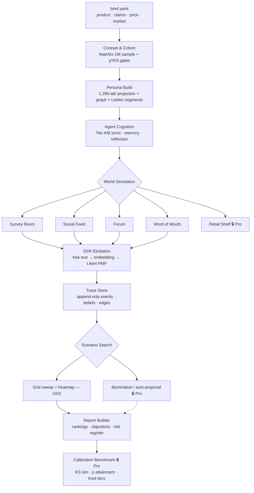
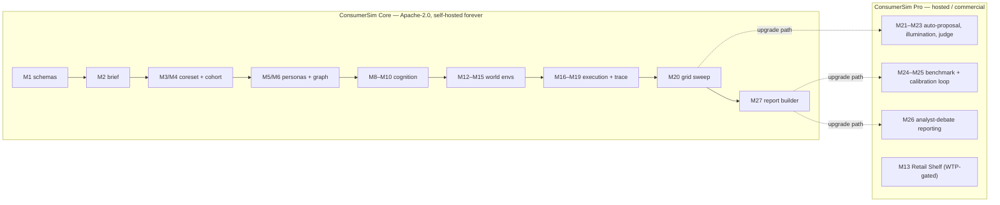
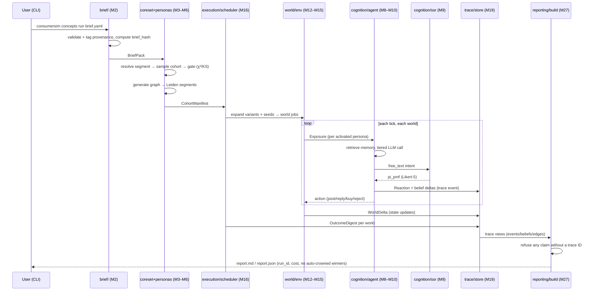

# OSSARCH.md — ConsumerSim Open-Source Architecture

**Status:** v1 draft · companion to `ARCHITECTURE.md` (OSS module spec, M1–M28) and `SALVAGE.md` (OSS-scoped salvage inventory) — both now trimmed to open-source scope, same as this document. The commercial/Pro-tier module specs and salvage detail that used to live in those two files now live in `../ideas/PRO_ARCHITECTURE.md`.
**Purpose:** this document scopes the **open-source release** — what ships publicly under a permissive license to build traction (GitHub stars, forks, contributors), versus what is held back as the commercial "Pro" layer. Module IDs (M1–M28) are identical across `ARCHITECTURE.md`, this document, and `../ideas/PRO_ARCHITECTURE.md` so all three stay cross-referenceable and never drift.
**Strategy this implements:** open-core. Ship the simulation engine for free, forever. Hold back the calibration/validation loop and enterprise reporting as the paid product. See "Why this split" below.
**License (this repo):** Apache-2.0 (matches upstream OASIS/ASAL; enables enterprise adoption and a future dual-license Pro tier without relicensing OSS users).

---

## 0. Positioning

**One-liner:** *A general-purpose engine for simulating populations of grounded AI personas — social platforms, markets, consumer behavior, economic scenarios — sampled from a real 1M-row dataset, not invented from a prompt.*

FMCG concept testing is the **flagship worked example**, not the ceiling of the pitch — it's the one vertical with a published, corporate-validated calibration method behind it (Colgate-Palmolive × PyMC Labs' Semantic Similarity Rating study). The repo's positioning is deliberately broader than that one vertical, because the underlying engine already spans more ground than any single open-source precedent:

| Capability | ConsumerSim (this repo) | OASIS | MatrAIx | MiroFish |
|---|---|---|---|---|
| Persona grounding | 1,290-attribute real dataset (MatrAIx-1M) | LLM-invented | 1,290-attribute real dataset | LLM-invented |
| Social platforms (feed / forum) | ✓ (forked from OASIS) | ✓ (origin) | ✗ | ✓ (via OASIS) |
| Word-of-mouth / graph diffusion | ✓ | partial | ✗ | partial |
| Market / economic scenario framing | ✓ (price, claims, concepts) | ✗ | survey-only | ✗ |
| Quantitative elicitation (SSR, anti-collapse) | ✓ | ✗ | structured JSON | ✗ |
| Scenario / grid search over outcomes | ✓ (grid + heatmap) | ✗ | ✗ | ad hoc |
| Full audit trace (every belief update logged) | ✓ | db-only | eval logs | ✗ |
| License | Apache-2.0 | Apache-2.0 | MIT | varies by fork |

**Why this framing wins on GitHub specifically:** MiroFish proved the model — a broad "predict anything" pitch built on OASIS's narrower social-simulation core reached 32K+ stars and real investor interest within weeks. ConsumerSim's actual salvaged surface area (OASIS + ASAL + MatrAIx + Generative-Agents-pattern memory) is genuinely wider than MiroFish's OASIS-only base, so the broad framing here is accurate, not inflated — see §5 for the line we don't cross.

---

## 1. Why this split (open-core rationale)

The architecture (originally `ARCHITECTURE.md` when it still covered both tiers, now split between that file and `../ideas/PRO_ARCHITECTURE.md`) already drew a phase boundary for engineering-scope reasons: Phases 0–3 (schemas → coreset → personas → cognition → world environments → execution → deterministic reporting) versus Phase 4+ (calibration benchmark, trust tiers, analyst-debate reporting, scenario illumination). That boundary turns out to be *exactly* the right open-core line, for a different reason:

- **What's open (Phases 0–3):** the simulation engine itself. It runs, it produces reactions and reports, and it never claims to be validated against real humans — because it hasn't been, for whatever category a given user points it at. Shipping this free is honest, not a loophole: the burden of proving accuracy for a specific use case legitimately sits with whoever runs it, because no calibration has occurred yet.
- **What's held back (Phase 4+):** the calibration/validation loop and the trust-tier system that turns "we ran a simulation" into "we benchmarked this against your historical data and it holds within a stated tolerance." That claim is expensive to earn (a real human-study benchmark, a gated patch-acceptance loop) and is what FMCG buyers actually pay for. Keeping it paid means the free tier never has to inflate what it can prove.

This is also why open-sourcing does **not** require watering down the pitch: the OSS repo can legitimately use broad, confident positioning ("simulate any population, any scenario") precisely *because* it isn't simultaneously claiming a specific validated accuracy number. The two claims don't compete; keeping them in separate tiers is what keeps both honest.

---

## 2. Repository layout (OSS scope)

```
consumersim/
├── OSSARCH.md                 ← this document
├── ARCHITECTURE.md            ← OSS module spec, M1–M28 (Pro modules stubbed/pointered, not detailed)
├── SALVAGE.md                 ← OSS-scoped salvage inventory (OASIS / MatrAIx, license-checked)
├── NOTICE.md                  ← required attribution: CAMEL-AI (OASIS), Sakana AI (ASAL — pattern only), MatrAIx
├── LICENSE                    ← Apache-2.0
├── pyproject.toml
├── simcore/
│   ├── schemas/                ← M1  — OSS
│   ├── brief/                  ← M2  — OSS
│   ├── coreset/                ← M3, M4 — OSS
│   ├── personas/                ← M5, M6 — OSS
│   ├── llm/                     ← M7 — OSS (provider-agnostic router; fake mode included)
│   ├── cognition/                ← M8, M9, M10 — OSS  (M11 skills: cut, not built anywhere yet)
│   ├── world/                     ← M12–M15 — OSS  (RetailShelf, M13, is Pro-only — needs WTP calibration)
│   ├── execution/                  ← M16–M18 — OSS
│   ├── search/                      ← M20 (grid+heatmap) OSS · M21/M22/M23 (opt/illuminate/judge) — 🔒 Pro, interface stubbed
│   ├── validation/                   ← M24, M25 — 🔒 Pro (stub raises `ProFeatureError` with upgrade link)
│   ├── reporting/                     ← M27 — OSS  · M26 (analyst debate) — 🔒 Pro
│   └── trace/                          ← M19 — OSS
├── examples/
│   ├── protein_water.yaml              ← FMCG concept test (flagship)
│   ├── subreddit_policy.yaml           ← forum/social dynamics
│   └── price_grid.yaml                 ← scenario sweep
├── scripts/                              ← M28 CLI: OSS commands work fully; Pro commands (`benchmark run`, `calibrate`) print an upgrade message
├── mockups/oss/                          ← this traction-facing site: index.html, workflow.html, quickstart.html
└── tests/                                 ← golden runs + fake-mode CI (no API key required)
```

**Design rule:** Pro-gated modules exist in the OSS tree as *typed interfaces with a clear error*, not silent no-ops and not omitted stubs that break imports. `from simcore.validation import calibrate` works and raises a clear, actionable `ProFeatureError`; it never fails with an unrelated import error. This keeps the boundary legible in the code, not just in this document.

---

## 3. Module inventory — OSS vs. Pro

Legend: ✅ **OSS** (ships, fully functional) · 🔒 **Pro** (interface present, gated) · ✂️ **cut** (not built anywhere, per `ARCHITECTURE.md` §8)

| # | Module | Layer | OSS/Pro | Salvage source | One-line purpose |
|---|---|---|---|---|---|
| M1 | `schemas/` | cross | ✅ OSS | NEW | Pydantic contracts: Brief, Persona, Exposure, Reaction, TraceEvent |
| M2 | `brief/` | L1 | ✅ OSS | NEW | Brief intake, provenance tagging, assumption ledger |
| M3 | `coreset/loader` | L2 | ✅ OSS | **MatrAIx** | Packed-4-bit dataset decode |
| M4 | `coreset/sampling` | L2 | ✅ OSS | MatrAIx + NEW | Cohort assembly + distribution gates |
| M5 | `personas/projection` | L2 | ✅ OSS | NEW | Persona record build + sparse completion |
| M6 | `personas/graph` | L2 | ✅ OSS | NEW + Leiden paper | Generated social graph + segmentation |
| M7 | `llm/router` | cross | ✅ OSS | NEW + **MatrAIx** model_client | Provider-agnostic router, incl. fake mode |
| M8 | `cognition/agent` | L3 | ✅ OSS | **OASIS** + **MatrAIx** templates | Persona-conditioned agent turn |
| M9 | `cognition/ssr` | L3 | ✅ OSS | **SSR paper** | Free text → Likert PMF (anti-collapse) |
| M10 | `cognition/memory` | L3 | ✅ OSS | **Generative Agents** paper | Memory stream + reflections |
| M11 | `cognition/skills` | L3 | ✂️ cut | VOYAGER pattern | Not built in OSS or Pro (see `ARCHITECTURE.md` §8) |
| M12 | `world/env` | L4 | ✅ OSS | **OASIS** | Env orchestration (`reset`/`step`) |
| M13 | `world/platforms` | L4 | ✅ OSS *(RetailShelf 🔒 Pro)* | **OASIS** | Survey/Feed/Forum/WOM live in OSS; RetailShelf needs WTP calibration first |
| M14 | `world/recsys` | L4 | ✅ OSS | **OASIS** | Info filter — all 4 modes salvaged, `twhin`/`random` land late |
| M15 | `world/schedule` | L4 | ✅ OSS | OASIS clock + pandemic-ABM | Activation clock + interventions (launch/promo only in v1) |
| M16 | `execution/scheduler` | L5 | ✅ OSS | NEW | RunConfig → world jobs |
| M17 | `execution/costs` | L5 | ✅ OSS | NEW + MatrAIx usage | Budget governor, degrade-not-fail |
| M18 | `execution/cache` | L5 | ✅ OSS | NEW | Dedupe inference/embedding calls |
| M19 | `trace/store` | cross | ✅ OSS | NEW + OASIS db shape | Append-only audit spine |
| M20 | `search/rollout` | L5 | ✅ OSS | generic (ASAL-adjacent) | Grid sweep batch runner |
| M21 | `search/opt` | L6 | 🔒 Pro | **ASAL** main_opt | Auto-proposal / CMA-ES over θ |
| M22 | `search/illuminate` | L6 | 🔒 Pro | **ASAL** main_illuminate | MAP-Elites scenario atlas |
| M23 | `search/judge` | L6 | 🔒 Pro | NEW | LLM-as-judge risk scoring (OSS uses rule-based flags instead) |
| M24 | `validation/bench` | L7 | 🔒 Pro | NEW + SSR metrics | Human-vs-synthetic benchmark |
| M25 | `validation/calibrate` | L7 | 🔒 Pro | MatrAIx self-report | Gated calibration loop, trust tiers |
| M26 | `reporting/analysts` | L8 | 🔒 Pro | **TradingAgents** pattern | Bull/bear analyst-debate reporting |
| M27 | `reporting/build` | L8 | ✅ OSS | NEW | Deterministic report renderer, full trace citations |
| M28 | `scripts/` CLI | — | ✅ OSS *(2 commands 🔒 Pro)* | NEW | `coreset-gate`, `concepts run`, `sweep run` OSS · `benchmark run`, `calibrate` Pro |

**Net:** 21 of 28 modules ship fully open. The rejected/cut module (M11) and the six Pro-gated modules (M13's RetailShelf, M21–M26) are exactly the set that either needs calibrated trust to be credible (RetailShelf pricing, illumination search) or *is* the calibrated-trust product itself (M24–M26).

---

## 4. Salvage inventory (OSS-scoped, license-checked)

Full per-file detail lives in `SALVAGE.md`; this section restates only what's relevant to a *public* release, with the licensing lens applied.

### 4.1 OASIS — `github.com/camel-ai/oasis` (Apache-2.0)

Feeds M8, M12–M15, M19. **Fully redistributable** — Apache-2.0 permits forking, modifying, and relicensing under Apache-2.0 with attribution. Action: keep license headers intact in every forked file, add CAMEL-AI attribution to `NOTICE.md`. No blockers.

### 4.2 ASAL — `github.com/SakanaAI/asal` (Apache-2.0)

Feeds M20–M23 (patterns only — nothing copy-pasted, JAX/CLIP is the wrong modality; reimplemented in plain Python). **Fully redistributable**, same as above. In the OSS release, only M20's generic grid-sweep pattern ships; M21–M23 (the actual ASAL-derived optimization/illumination/judge algorithms) are **Pro-gated by design**, not by license — the license would allow shipping them open, but they're withheld as the commercial scenario-search upgrade.

### 4.3 MatrAIx — `github.com/MatrAIx-ai/MatrAIx-Persona-8B` (MIT) + HF `MatrAIx2026/MatrAIx_Persona_1M` (dataset — **license unconfirmed**)

Feeds M3–M5, M7–M9, M17, M25. The **code** (`persona_codes.schema.json`, `model_client.py`, `templating.py`, etc.) is MIT — fully redistributable with attribution, no blocker.

**The dataset is a separate, unresolved question, and it is the single blocking item before public launch:**

- `SALVAGE.md` already flags this: *"MatrAIx Persona-1M dataset: confirm commercial terms before paid deployment."* Going open-source makes this more urgent, not less — a public repo gets its licensing scrutinized fast (an open GitHub issue pointing out a dataset-terms problem is exactly the kind of thing that can stall momentum right after a launch).
- **Recommended mitigation for the OSS release:** do **not** bundle or redistribute the parquet shards in this repo. Ship `coreset/loader` as code only; have it download the dataset directly from the HF hub at first run, so end users accept the dataset's own HF terms themselves (standard practice — this is how most gated/researchy HF datasets are consumed by OSS tooling). Confirm the HF dataset card's stated terms permit this kind of downstream tool use before launch; if terms are restrictive, ship a small, clearly-synthetic fallback persona set (a few hundred generated profiles, explicitly labeled `provenance=SYNTHESIZED`, never `GROUNDED`) so the OSS quickstart still works standalone, and treat the full 1M-row grounded dataset as something the user brings themselves.
- This is a **pre-launch checklist item**, not an engineering task — resolve it before the repo goes public, not after stars start arriving.

### 4.4 Papers with no salvageable code (spec-only sources)

SSR paper (M9), Generative Agents (M10), TradingAgents (M26 — Pro only) — these contribute *methodology*, not code, so there's no license question; they're cited in `NOTICE.md` and in the README as "implements the method described in…", which also does double duty as a credibility/SEO hook for anyone who found this repo via the papers themselves.

---

## 5. The line the OSS release does not cross

Repeating this explicitly because it's the one failure mode that can undo everything else in this document: broad *positioning* ("simulate any population") is fine and is exactly what made MiroFish's launch work. Publishing a **specific, unearned accuracy number** in the OSS README (e.g., quoting the Colgate-Palmolive study's 90% correlation figure as if it were *this tool's own, unvalidated* result) is not fine — it's the one thing that reliably gets an AI-hype repo torn apart on Hacker News, and unlike a private sales deck, it's permanent and public.

**Rule for the README and all launch copy:** cite the SSR paper as *"the method this engine implements"* (true, verifiable, and flattering), never as *"our accuracy"* (unearned, until Pro's M24 benchmark has actually been run against a given user's data).

---

## 6. Architecture diagrams

### 6.1 End-to-end pipeline



### 6.2 Open-core module boundary



### 6.3 One simulation run (sequence)



### 6.4 Salvage provenance map

```mermaid
flowchart TD
    subgraph OASIS_SRC["camel-ai/oasis — Apache-2.0"]
        O1["env.py / make.py"]
        O2["agent_graph.py"]
        O3["platform.py, recsys.py"]
        O4["clock.py"]
    end
    subgraph ASAL_SRC["SakanaAI/asal — Apache-2.0 (pattern only)"]
        A1["Init/Step/Render contract"]
        A2["main_opt.py — CMA-ES"]
        A3["main_illuminate.py — MAP-Elites"]
    end
    subgraph MATRAIX_SRC["MatrAIx-Persona-8B — MIT (code) + HF dataset (terms TBD)"]
        X1["persona_codes.schema.json + parquet"]
        X2["model_client.py, openai_client.py"]
        X3["templating.py"]
    end
    subgraph PAPERS["Papers — method only, no code"]
        P1["SSR: Colgate-Palmolive × PyMC Labs"]
        P2["Generative Agents: memory + reflection"]
    end

    O1 --> M12["M12 world/env"]
    O2 --> M6["M6 personas/graph"]
    O3 --> M13["M13 world/platforms"] & M14["M14 world/recsys"]
    O4 --> M15["M15 world/schedule"]
    A1 -.Pro.-> M22["M22 search/illuminate"]
    A2 -.Pro.-> M21["M21 search/opt"]
    A3 -.Pro.-> M22
    X1 --> M3["M3 coreset/loader"]
    X2 --> M7["M7 llm/router"]
    X3 --> M8["M8 cognition/agent"]
    P1 --> M9["M9 cognition/ssr"]
    P2 --> M10["M10 cognition/memory"]
```



---

## 7. CLI surface (M28, OSS vs. Pro)

| Command | Modules | OSS/Pro | Behavior |
|---|---|---|---|
| `coreset-gate` | M3, M4 | ✅ OSS | Full functionality |
| `ssr-replica` | M7, M9 | ✅ OSS | Full functionality |
| `concepts run` | M2, M16, M19, M27 | ✅ OSS | Full functionality, incl. `--fake` mode |
| `sweep run` | M20 | ✅ OSS | Grid + heatmap only (no illumination) |
| `benchmark run` | M24 | 🔒 Pro | Prints upgrade message + docs link, does not run |
| `calibrate` | M25 | 🔒 Pro | Prints upgrade message + docs link, does not run |

All commands print `run_id`; gate failures use distinct exit codes from crashes (unchanged from `ARCHITECTURE.md`).

---

## 8. Traction roadmap (public, in the README as a checklist)

A visible, honest roadmap is itself a growth lever — it signals momentum and gives contributors an obvious place to help, while doubling as a soft preview of the commercial roadmap for anyone (including a future investor) reading the repo.

- [x] Core engine: coreset → cohort → cognition → world envs → trace → report (Phases 0–2 of `ARCHITECTURE.md`)
- [x] Fake mode (zero-API-key demo path)
- [ ] Community-scoped forum preset (Leiden-segmented threads)
- [ ] Grid sweep + measured heatmap (Phase 3)
- [ ] Public example gallery (concept test, subreddit sim, price sweep, election-poll sim)
- [ ] Short technical report (arXiv) alongside the repo
- [ ] 🔒 Hosted calibration benchmark (Pro, Phase 4)
- [ ] 🔒 Scenario illumination / auto-proposal (Pro)
- [ ] 🔒 Analyst-debate reporting (Pro)

---

## 9. Mockups

Traction-facing HTML mockups live in `mockups/oss/` (separate from the existing SaaS-dashboard mockups in `mockups/`, which model the *commercial* product surface and are not part of the public repo):

- `mockups/oss/index.html` — landing/positioning page: hero, badges, OASIS/MatrAIx/MiroFish comparison table, open-core split, example gallery.
- `mockups/oss/workflow.html` — the full pipeline visualized two ways: a live-rendered Mermaid flowchart (same diagram as §6.1) plus a stage-by-stage written breakdown with salvage-source tags.
- `mockups/oss/quickstart.html` — CLI quickstart mockup: install → gate a cohort → run in fake mode → run for real → sweep a grid → hit the Pro-gated command and see the upgrade message in place.

These reuse the existing `styles.css` design tokens (via `oss.css` as a thin addendum) so the OSS marketing site and the eventual Pro dashboard (`mockups/*.html`) read as one visual family.
