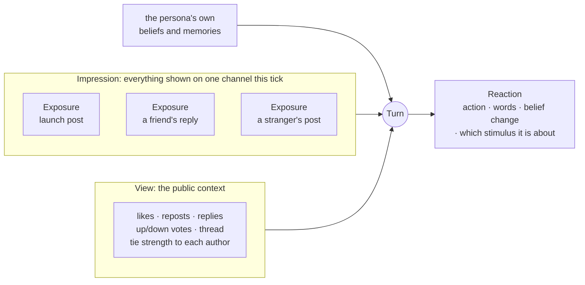

# Channels

A **channel** is a way news of the product reaches a persona from outside the study's own survey. Jahan has
three, and a scenario runs any combination of them, including none:

| Channel | Modelled on | Information spreads by | A persona can |
|---|---|---|---|
| `social_feed` | X (Twitter) | a ranked feed of posts | post, comment, like, repost, quote, follow |
| `forum` | Reddit | ranked threads anyone can reply to | post, reply, upvote, downvote |
| `wom` | word of mouth | one persona telling a close tie | ask a peer, comment, complain, reject, buy |

With **no channels**, nothing spreads: each persona only ever sees the concept in the survey, which makes it
the cleanest baseline for "what does the concept alone do?". The survey itself is not a channel. It is the
internal *survey room* a [survey wave](measuring-intent.md) uses, with one action: answer.

A persona may *attempt* anything; the channel decides what **lands**. Upvoting on the feed does nothing,
because the feed has no votes. Ignoring always lands.

## What a persona sees in one turn

- An **exposure** is one thing shown to one persona, with why it got through and how much attention it drew.
  A persona is shown at most `exposure_budget` (default 3) per channel per tick; anything cut is logged with a
  reason.
- An **impression** is everything one persona is shown on one channel in one tick. Personas react to the
  impression as a whole, not to each item separately, because seeing two things side by side is not the
  same as seeing each alone ([ADR 0003](../adr/0003-personas-react-to-impressions.md)).
- The **view** is the public context: engagement counts, the thread an item belongs to, and the persona's tie
  strength to each author. It never shows other personas' private beliefs, and never how the study is turning
  out. A persona that could see running adoption would react to the very result being measured.
- **Social proof appears one tick late.** Engagement becomes visible from the tick *after* it happens, never
  within the same tick, so the order in which personas take their turns cannot matter
  ([ADR 0010](../adr/0010-a-view-is-recorded-and-verified-with-next-tick-visibility.md)).

The reaction records both the whole impression it saw and the one stimulus it is about.

## The feed (X-like)

The feed follows X's open-sourced home timeline as ported by OASIS[^oasis]:

1. **In-network first.** Posts by the persona's ties and follows come first, most-liked first.
2. **Then everything else, by interest × recency.** For a persona with profile vector $\mathbf{u}$ and a post
   with vector $\mathbf{v}$, published $\Delta t$ ticks ago:

$$
\text{score} = \cos(\mathbf{u}, \mathbf{v}) \times \ln\!\left(\frac{271.8 - \Delta t}{100}\right)
$$

The recency factor is OASIS's, kept verbatim: it is about 1.0 for a new post, about 0.91 after 24 ticks, falls
below zero after 171.8 ticks, and a post older than 271.8 ticks can no longer be recommended.

Profile and post vectors come from a separately pinned **ranking embedding model**
(`--recsys-embed-model`), in the spirit of TwHIN-BERT[^twhin], X's own social text encoder. The vectors are
embedded once and refreshed only when a persona posts. They never enter purchase-intent scoring, which has its
own embedding model.

When no ranking model is pinned, the feed falls back to **random** order: a seeded shuffle that ignores
engagement entirely. Random is also the **control arm**: comparing a ranked feed with a random one separates
effects caused by the ranking from effects that spread organically.

## The forum (Reddit-like)

Threads are ranked by Reddit's **hot** score, copied verbatim from Reddit's original source as ported by
OASIS. For a thread with $u$ upvotes and $d$ downvotes, $s = u - d$, published at time $t$ in seconds:

$$
\text{hot} = \operatorname{sign}(s) \cdot \log_{10}\big(\max(\lvert s \rvert, 1)\big) + \frac{t - 1134028003}{45000}
$$

The time is *when the post was published*, not its age: later posts score higher. In Jahan $t$ is the
publication tick times the tick unit's seconds, since simulated time is declared in ticks.

!!! example "Worked example: freshness beats votes"
    Daily ticks. Thread A was published on day 0 and has 10 net upvotes; thread B was published on day 1 and
    has none.

    - A gains $\log_{10} 10 = 1$ from votes.
    - B gains $86{,}400 / 45{,}000 = 1.92$ from being one day newer.

    B ranks above A. To keep its place, A would need about $10^{1.92} \approx 83$ net upvotes. That is what
    makes Reddit's front page turn over, and what makes herding fast: early votes on a new thread compound.

The forum also has a **community-scoped** preset in the engine: threads visible only within a persona's
community, ranked by agreement minus age, no hot score. It produces slow hardening rather than fast herding.
It exists in the world module and its tests; studies currently run the global Reddit preset.

## Word of mouth

Word of mouth is not a platform. It is the social network carrying news from one persona to another. After a
reaction, a persona tells a peer when **both** hold:

- it felt strongly, with **sentiment strength** at least 0.6;
- the two are close, with **tie strength** at least 0.3.

Sentiment strength is the largest move in the reaction: the biggest absolute belief change across belief
dimensions and claims, or, when the reaction carries a scored intent with expected rating $\mathbb{E}[x]$ on the
1–5 scale, its extremeness

$$
\frac{\lvert \mathbb{E}[x] - 3 \rvert}{2}
$$

which is 0 for a neutral 3 and 1 for a certain 1 or 5. A persona tells at most **2** qualifying peers per tick,
chosen by a seeded shuffle, so one strong reaction cannot cross a dense community in a single tick. The
message arrives as an exposure on the **next** tick, never the same one.

!!! example "Worked example"
    A persona's intent distribution is $(0.02, 0.03, 0.10, 0.35, 0.50)$, so
    $\mathbb{E}[x] = 1(0.02) + 2(0.03) + 3(0.10) + 4(0.35) + 5(0.50) = 4.28$ and sentiment strength
    $= \lvert 4.28 - 3 \rvert / 2 = 0.64 \ge 0.6$. It has ties of strength 0.58, 0.41, 0.22 and 0.35. Three
    qualify (≥ 0.3); two of them, drawn by the seeded shuffle, hear about the product next tick.

**Launch reach.** When word of mouth is the *only* channel, nobody has anything to pass on at first, so a share
of personas (`launch_reach`, default 10%, chosen at random) hear of the product first-hand at launch. Feeds and
forums need none: their launch posts reach whoever is active.

[^oasis]: Z. Yang et al. (2024). "OASIS: Open Agent Social Interaction Simulations with One Million Agents."
    arXiv:2411.11581. Code: <https://github.com/camel-ai/oasis> (Apache-2.0). Reddit's hot ranking originates
    in Reddit's open-sourced code (`_sorts.pyx`, 2010).
[^twhin]: X. Zhang et al. (2023). "TwHIN-BERT: A Socially-Enriched Pre-trained Language Model for
    Multilingual Tweet Representations at Twitter." *KDD 2023*. arXiv:2209.07562.
