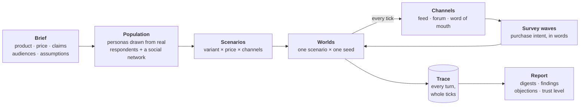

# How a study works

A **study** asks one question about one product: *how would these people react to it?* Jahan answers by
building a population of simulated people, letting them meet the product and each other over simulated time,
asking them whether they would buy it, and recording everything that happened so every number can be checked.

This page walks through a study from start to finish. Each step has its own page with the detail.

## 1. You write a brief

The [brief](brief.md) describes the product: its name, category, price and competitors, the **claims** it makes
("20g protein with zero sugar"), where each claim came from, and the **audiences** you want to study ("people
who train three or more times a week, 60% of the sample"). Anything you take as true without evidence is
written down as an **assumption**, and every report repeats it.

## 2. Jahan draws a population

Every simulated person, a **persona**, is one real row of a persona dataset: a survey respondent, a product
reviewer, a public figure. Personas are [sampled, never invented](population.md). The draw is checked by
statistical **gates** before any model is called; a draw that does not look like the audience you asked for
is refused.

The personas are then tied into a [social network](social-network.md) shaped by who resembles whom, and the
network's **communities** are discovered in it.

## 3. Scenarios are run as worlds

A [scenario](scenarios-and-worlds.md) is one version of the product at one price, reaching people through a
chosen set of channels for a stated number of **ticks** (hours, days or weeks). Each scenario is run several
times with different seeds; each run is a **world**. How much the worlds disagree is the study's estimate of
its own noise.

## 4. Personas meet the product and each other

On every tick, some personas are active. Each active persona is shown what reached it on each
[channel](channels.md): an X-like feed, a Reddit-like forum, or a friend telling it about the product. It
reacts in its own words: it likes, replies, posts, tells a friend, or ignores. Its
[beliefs and memories](beliefs-and-memory.md) carry forward to the next tick.

## 5. Survey waves measure intent

At scheduled ticks every persona is asked *how likely are you to purchase the product?* and answers in its own
words. The answer is turned into a five-point distribution by
[comparing its meaning to fixed reference statements](measuring-intent.md), never by asking a model for a
number.

## 6. Everything is recorded

Each persona's reaction is one **turn**, and every turn is written to an append-only [trace](trace.md), one
whole tick at a time. A study can be stopped, resumed and replayed exactly. The prompt behind any turn can be
rebuilt from the record and is shown only if it matches the fingerprint taken when the turn ran.

## 7. The report is derived from the record

[Results](results-and-trust.md) are computed from the trace and nothing else: adoption per wave, how far
beliefs moved, the objections people raised in their own words, and patterns such as herding. Every finding
carries the trace records behind it and the real-world test that would prove it wrong. Every report states its
**trust level**, which today is always *uncalibrated*. See [Limitations](limitations.md) for what that means.

## A study at a glance

| Step | Input | What happens | Output |
|---|---|---|---|
| Brief | your YAML file + a category ontology | checked against the engine's contracts | a validated brief and its assumption ledger |
| Population | corpus + study size + seed | filter, sample, gate, fill gaps, build network | personas, network, communities, gate report |
| Worlds | scenarios × seeds | ticks of activation, exposure, reaction | the trace |
| Analysis | the trace | digests, objection clusters, anomalies, findings | the report (Markdown + JSON) |
