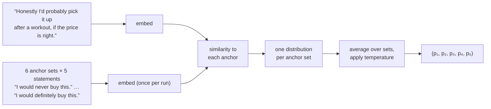

# Measuring purchase intent

The question a study exists to answer is *would people buy this?* Jahan asks it in a **survey wave**, but it
never asks a model for a number. Language models asked for a rating on a 1–5 scale give unrealistic answers:
they pile onto the safe middle and their distributions look nothing like real survey data. Instead, each
persona answers **in its own words**, and the words are converted to a five-point distribution by comparing
their meaning with fixed reference statements. The method is **semantic similarity rating (SSR)**, from Maier
et al. (2025)[^ssr], who found it reproduces human purchase-intent distributions from real consumer surveys
where direct numeric ratings did not.

## Survey waves

At every [wave tick](scenarios-and-worlds.md#survey-waves) every persona is put the question in a private
**survey room**: no feed, no social signals, one exposure (the concept), one action (answer).

> How likely are you to purchase the product? Answer briefly in your own words, as yourself. Do not use
> numbers, ratings, scores, percentages, fractions, or stars.

A wave only reads. A persona answers from what it remembers, and answering changes nothing about it. Every
study has at least one wave, and repeated waves turn intent into a trajectory over time. A wave is answered by
everyone: the budget never thins one.

**No numbers, enforced.** The instruction alone is not trusted. An answer carrying a rating ("I'd give it a 4",
"8 out of 10", "four stars", "★★★★") is detected and recorded as an elicitation failure, with no distribution.
A number that *describes* the product ("20g of protein", "50% off", "a pack of 6") is fine. No code path scores
a rating a model emitted.

## From words to a distribution

**Anchor statements.** A construct such as purchase intent has **anchor sets**: six sets of five statements,
one per point of the scale, worded differently on purpose. The first set of `purchase_intent/v2`:

| point | statement |
|---|---|
| 1 | I would never buy this. |
| 2 | I probably would not buy this. |
| 3 | I might or might not buy this. |
| 4 | I probably would buy this. |
| 5 | I would definitely buy this. |

The response and all anchors are embedded by **one pinned embedding model**, with no fallback: similarities
between two different embedding spaces mean nothing.

### Step 1: similarity

For the response vector $\mathbf{r}$ and anchor vector $\mathbf{a}_i$, cosine similarity is mapped from
$[-1, 1]$ to $[0, 1]$:

$$
\gamma_i = \frac{1 + \cos(\mathbf{r}, \mathbf{a}_i)}{2}
$$

### Step 2: one distribution per anchor set

Within each set, subtract the least similar anchor's similarity and normalise. With $\gamma_{\min}$ the
smallest of the five and $\varepsilon \ge 0$ a small constant added to the least similar point:

$$
p_i = \frac{\gamma_i - \gamma_{\min} + \varepsilon \cdot [\, i = \arg\min \gamma \,]}{\sum_{j=1}^{5} \gamma_j - 5\,\gamma_{\min} + \varepsilon}
$$

Subtracting the minimum is what makes the method work: raw similarities to five sentences about buying are all
close together, and only their *differences* carry the answer.

### Step 3: average and temperature

Average the six per-set distributions, then apply a temperature $T$ once:

$$
\bar p_i = \frac{1}{6} \sum_{s=1}^{6} p_i^{(s)}, \qquad
p_i^{\text{final}} = \frac{\bar p_i^{\,1/T}}{\sum_j \bar p_j^{\,1/T}}
$$

$\varepsilon$ and $T$ are study parameters defaulting to the paper's $\varepsilon = 0$ and $T = 1$, and they are
never tuned on validation data. The raw similarities are recorded with every answer, so changing $\varepsilon$
or $T$ later is arithmetic on the trace, not a re-run
([ADR 0026](../adr/0026-elicitation-computes-the-papers-ssr-formula.md)).

!!! example "Worked example"
    A response's similarities to two anchor sets (two shown instead of six to keep it short):

    | | point 1 | point 2 | point 3 | point 4 | point 5 |
    |---|---|---|---|---|---|
    | set 1, $\gamma$ | 0.70 | 0.74 | 0.80 | 0.86 | 0.84 |
    | set 2, $\gamma$ | 0.66 | 0.71 | 0.75 | 0.83 | 0.85 |

    **Set 1:** $\gamma_{\min} = 0.70$; the denominator is $3.94 - 5 \times 0.70 = 0.44$, so
    $p = (0, 0.04, 0.10, 0.16, 0.14) / 0.44 = (0, 0.091, 0.227, 0.364, 0.318)$.

    **Set 2:** $\gamma_{\min} = 0.66$; the denominator is $3.80 - 3.30 = 0.50$, so
    $p = (0, 0.10, 0.18, 0.34, 0.38)$.

    **Average** ($T = 1$): $(0, 0.095, 0.204, 0.352, 0.349)$. The expected rating is
    $\sum_i i\,p_i = 3.95$, and the chance of a 4 or 5 is $0.352 + 0.349 = 0.701$.

    At $T = 0.5$ the same average sharpens to $(0, 0.031, 0.140, 0.418, 0.411)$.

    Note how close the raw similarities are, all between 0.66 and 0.86. Without subtracting the minimum,
    every point would get about a fifth of the mass.

## Is an anchor set good enough to use?

Anchors are written by hand, so before a version may be **pinned** to a study it must pass the **anchor check**
against the real embedding model ([ADR 0027](../adr/0027-anchor-statements-are-frozen-before-they-are-validated.md)):

| Check | What it asks | Passes at |
|---|---|---|
| Ladder | a frozen ladder of seven graded answers, from a clear no to a clear yes, scores in increasing order | strictly increasing |
| Rank stability | every pair of anchor sets ranks the ladder the same way (Spearman correlation[^spearman]) | lowest pair > 0.8 |
| Non-collapse | varied answers do not all land on the same distribution | distance ≥ 0.1 |

A version is frozen *before* it is checked, and a failing version is never edited and re-checked: a version
fitted to its own test is evidence of nothing. A fix is a new version.

!!! note "Measured"
    `purchase_intent/v1` **failed** on two embedding models (rank stability 0.500 on both Titan v2 and Nova 2):
    its top statements drifted between "buy", "try" and "choose", and the models ordered them by wording rather
    than intensity. `purchase_intent/v2` keeps every statement about *buying*, with one clear probability word
    per point, and **passed on its first check** against Titan v2 (rank stability 0.929). See
    [Results so far](../research/results.md).

A study with no passing anchor version still runs. Every answer is kept word for word, and adoption is reported
as **unmeasured**, with the reason, never as zero
([ADR 0032](../adr/0032-an-unscorable-reaction-keeps-its-verbatim.md)).

## Two different claims

| Claim | Means | Checked by | Status |
|---|---|---|---|
| **Mapping claim** | SSR recovers the rating a real person gave from what that person wrote | human reviews that carry their own star rating | owed: needs a passing satisfaction anchor version |
| **Simulation claim** | simulated personas' distributions match real people's for this product | human answers to the same question about the same product | owed: no benchmark exists yet |

A study's findings rest on the **simulation claim**, which is why every report today says *uncalibrated*
([ADR 0028](../adr/0028-elicitation-validates-the-mapping-and-owes-the-simulation.md)).

[^ssr]: B. F. Maier et al. (2025). "LLMs Reproduce Human Purchase Intent via Semantic Similarity Elicitation of Likert Ratings."
    arXiv:2510.08338. Reference implementation: <https://github.com/pymc-labs/semantic-similarity-rating>
    (Apache-2.0), from which Jahan's computation is ported with attribution.
[^spearman]: C. Spearman (1904). "The proof and measurement of association between two things." *American
    Journal of Psychology*, 15(1), 72–101.
