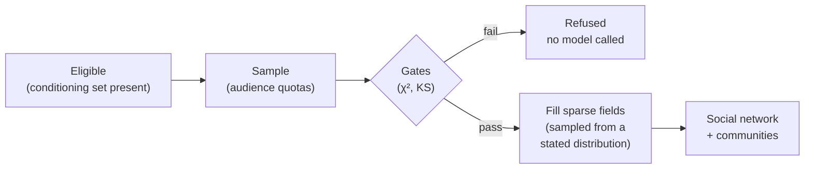

# Personas and the population

A **persona** is one simulated person. In Jahan a persona is never invented by a model: it is **one real row**
of a persona dataset, drawn at random. The **population** is every persona in a study, together with the social
network that ties them and the communities found in it. A study has exactly one population, built once and
carried through every scenario ([ADR 0015](../adr/0015-a-population-is-built-once-and-carried.md)).

## Where personas come from

The default corpus is **MatrAIx Persona 1M**[^matraix], about a million rows described by up to 1,290
attributes, gathered from several **sources**:

| Source | What a row is | How its fields were obtained |
|---|---|---|
| `gss` | a General Social Survey respondent | answered |
| `stackoverflow` | a Stack Overflow Developer Survey respondent | answered |
| `prism` | a PRISM alignment-study participant | answered |
| `real_human_survey` | a respondent to another human survey | answered |
| `wiki` | a person described on Wikipedia | read from text by a model |
| `amazon` | an Amazon product reviewer | read from text by a model |
| `synthetic` | a generated row | invented |

The corpus is released for **research only** (`matraix-research-only`). It is not in this repository: you
download it yourself and accept its terms ([ADR 0016](../adr/0016-the-engine-is-a-research-instrument.md)).
Any other population you have the rights to can be plugged in through the same port.

## How much each value is worth: evidence tiers

Sources differ enormously in what their values mean. A survey answer is a measurement; a model's reading of a
Wikipedia biography is a claim about a text. Jahan states, for **every field of every persona**, which kind of
value it holds ([ADR 0017](../adr/0017-grounding-is-measured-extracted-or-synthesized.md)):

| Tier | Meaning | Example |
|---|---|---|
| **Measured** | an instrument recorded it | a GSS respondent's age bracket |
| **Extracted** | a model read it from corpus text, or inferred it from other answers | a reviewer's diet, read from their reviews |
| **Calibrated** | corrected against external human data | *reserved; nothing produces it yet* |
| **Synthesized** | filled in by a model because the row was sparse | a monthly budget, completed for this study |

The tiers are ordered strongest to weakest. A tier **grades** a claim; it never blocks one. But anything
judged on several fields is graded by the **weakest** tier among them, so a pass can never be read as stronger
evidence than its weakest input.

!!! note "Two rules that never bend"
    - **Demographics and psychographics are never synthesized.** A model may fill in an economic, media or
      decision-rule field; it may never invent someone's age or attitudes for a study.
    - **A tier is stated, never inferred.** A field with no tier is an error, not a measured value.

## Building a population, step by step

### 1. Eligibility comes first

The category ontology names a **conditioning set**: the attributes a persona must carry for its answers to mean
anything (for example age, sex and exercise frequency for a protein drink). A row missing any of them is never
**eligible**. This is decided at the index, before sampling, because dropping incomplete rows *after* sampling
quietly skews the population toward the corpus's most complete rows, which are its synthetic ones
([ADR 0002](../adr/0002-conditioning-set-filters-before-sampling.md)).

### 2. Sampling by audience quota

Each audience gets a quota from its declared share, rounded by largest remainder so the quotas sum exactly to
the study size. For 1,500 personas at shares 0.6 / 0.4 the quotas are 900 and 600. Each audience is drawn
from its eligible rows with a seeded generator, and a row is drawn at most once even if it fits two audiences.

When too few rows match an audience, the filter is loosened by a fixed ladder, and every step is recorded as a
**relaxation** on the gate report:

1. widen an ordinal filter by one band;
2. drop the least relevant filter that is not in the conditioning set;
3. accept the shortfall, so the achieved mix tells the truth;
4. fail only if the audience matches nobody at all.

The conditioning set is never a rung: trading it for coverage would undo the reason it exists.

### 3. Gates: does the draw look like what was asked for?

Before any model is called, every gated attribute of the sample is compared with a **reference**: what the
study's own design implies (each audience's eligible pool, weighted by its share), or, for a study that
declares no audiences, the category's measured targets. Gates run only on **measured or extracted**
attributes, never on synthesized ones, since that would be grading an invention.

#### Categorical attributes: Pearson's χ² test

For an attribute with categories $i = 1 \dots k$, observed counts $O_i$ and expected counts $E_i$ (the
reference shares scaled to the sample size):

$$
\chi^2 = \sum_{i=1}^{k} \frac{(O_i - E_i)^2}{E_i}, \qquad \text{df} = k - 1
$$

The p-value is the χ² survival function at that statistic. The gate passes when the p-value is above the
significance level $\alpha = 0.05$.[^pearson]

!!! example "Worked example"
    The reference expects 50% women and 50% men; a draw of 100 personas has 58 and 42.

    $$
    \chi^2 = \frac{(58-50)^2}{50} + \frac{(42-50)^2}{50} = 1.28 + 1.28 = 2.56, \qquad \text{df} = 1
    $$

    $p = 0.110 > 0.05$, so the gate **passes**: a split this uneven happens about one time in nine by chance
    alone.

#### Many attributes at once: Holm's correction

Testing many attributes separately at 0.05 makes a fair sample fail by chance. With $m$ independent tests the
chance that at least one fails is $1 - 0.95^{m}$: about 30% for 7 attributes and 77% for 29. So the
categorical gates of one report are judged as **one family** with Holm's step-down adjustment[^holm]
([ADR 0049](../adr/0049-a-populations-categorical-gates-are-one-family.md)). Sort the $m$ p-values ascending,
$p_{(1)} \le \dots \le p_{(m)}$, then

$$
\tilde p_{(j)} = \max_{l \le j} \; \min\!\big(1,\; (m - l + 1)\, p_{(l)}\big)
$$

A gate passes when its **adjusted** p-value $\tilde p$ is above $\alpha$. The level now bounds the chance that a
fair sample fails *any* gate, not each one. Both the raw and adjusted p-values are reported.

!!! example "Worked example"
    Three categorical gates return $p = 0.012,\ 0.040,\ 0.300$.

    | rank $j$ | raw $p$ | $(m-j+1)\,p$ | adjusted $\tilde p$ | verdict at 0.05 |
    |---|---|---|---|---|
    | 1 | 0.012 | 3 × 0.012 = 0.036 | 0.036 | fail |
    | 2 | 0.040 | 2 × 0.040 = 0.080 | 0.080 | pass |
    | 3 | 0.300 | 1 × 0.300 = 0.300 | 0.300 | pass |

    Unadjusted, two gates would have failed. After adjustment only the strongest skew does, and the population
    is still refused, since any failing gate rejects it.

#### Ordered attributes: Kolmogorov–Smirnov similarity

For an attribute whose bands have an order (rarely < weekly < 3+ a week), the gate compares cumulative shares
instead. With $F_S$ the sample's cumulative distribution over the declared band order and $F_R$ the reference's:

$$
D = \max_{b} \left| F_S(b) - F_R(b) \right|, \qquad \text{similarity} = 1 - D
$$

The gate passes when the similarity is at least **0.80**. It is named *similarity* so the threshold reads the
way it means: higher is better.[^ks]

!!! example "Worked example"
    | band | reference share | sample share | $F_R$ | $F_S$ | $\lvert F_S - F_R\rvert$ |
    |---|---|---|---|---|---|
    | rarely | 0.20 | 0.10 | 0.20 | 0.10 | 0.10 |
    | weekly | 0.50 | 0.50 | 0.70 | 0.60 | 0.10 |
    | 3+ weekly | 0.30 | 0.40 | 1.00 | 1.00 | 0.00 |

    $D = 0.10$, so the similarity is $0.90 \ge 0.80$ and the gate **passes**.

Any failing gate rejects the population, and no model is ever called for a rejected draw. Checking a draw is
therefore free. Every threshold above is a recorded study parameter with the engine's default, never an
environment variable, so a loosened gate travels with the population that used it.

### 4. Filling in what the row lacks

Survey rows rarely carry everything a category needs: a GSS respondent was never asked about protein drinks.
Where the ontology allows it, a model fills the gap, but **never with free text**. It is shown the persona's
known attributes and the attribute's **closed list of values from the corpus**, and states a probability for
each. The engine then **samples** the value from that distribution with the population's seeded random stream
([ADR 0024](../adr/0024-a-completed-attitude-is-sampled-by-the-engine-from-a-distribution.md)). The value is
marked *synthesized*, and the distribution it was drawn from is recorded beside it.

Sampling, not taking the most likely value, matters: if every 30-year-old woman got the single likeliest
attitude, everyone with the same demographics would think alike, and the network would look more opinionated
than any real population. How widely values may vary is the study's **completion temperature** $T$. With
stated probabilities $p_i$:

$$
p_i' = \frac{p_i^{1/T}}{\sum_j p_j^{1/T}}
$$

$T = 1$ samples from what the model stated; $T < 1$ sharpens toward the likeliest value; $T > 1$ flattens.

!!! example "Worked example"
    The model states $(0.6, 0.3, 0.1)$ for *budget-conscious / balanced / premium*.

    | $T$ | distribution sampled from |
    |---|---|
    | 0.5 | (0.783, 0.196, 0.022) |
    | 1.0 | (0.600, 0.300, 0.100) |
    | 2.0 | (0.473, 0.334, 0.193) |

A distribution that does not cover every value, or does not sum to one, is refused rather than repaired, and
the field is left empty. A persona missing a non-conditioning attribute is valid; a persona with an invented
vocabulary is not.

!!! warning "Measured: filled-in attitudes are weak"
    The engine's own holdout found that model-filled attitudes capture *relative* differences between groups
    but lose to a plain demographic baseline overall. See
    [Results so far](../research/results.md#holdout).

### 5. The social network

Last, personas are tied into a network and its communities are discovered. See
[The social network](social-network.md).

## What the population carries

A built population records the row each persona came from, the requested and achieved audience mix, the
source mix, every relaxation, every gate with its threshold and verdict, the tier of every field, the
completion distributions, and a hash of all of it. A rebuild against a live model would be a *different*
population (the completions would differ), so a population is built once and carried, never rebuilt.

[^matraix]: MatrAIx. *MatrAIx Persona 1M* (dataset), Hugging Face `MatrAIx2026/MatrAIx_Persona_1M`, and
    *MatrAIx-Persona-8B*, <https://github.com/MatrAIx-ai/MatrAIx-Persona-8B>. Released under
    `matraix-research-only`.
[^pearson]: K. Pearson (1900). "On the criterion that a given system of deviations from the probable in the
    case of a correlated system of variables is such that it can be reasonably supposed to have arisen from
    random sampling." *Philosophical Magazine*, 50(302), 157–175.
[^holm]: S. Holm (1979). "A simple sequentially rejective multiple test procedure." *Scandinavian Journal of
    Statistics*, 6(2), 65–70.
[^ks]: A. Kolmogorov (1933). "Sulla determinazione empirica di una legge di distribuzione." *Giornale
    dell'Istituto Italiano degli Attuari*, 4, 83–91; N. Smirnov (1948). "Table for estimating the goodness of
    fit of empirical distributions." *Annals of Mathematical Statistics*, 19(2), 279–281.
