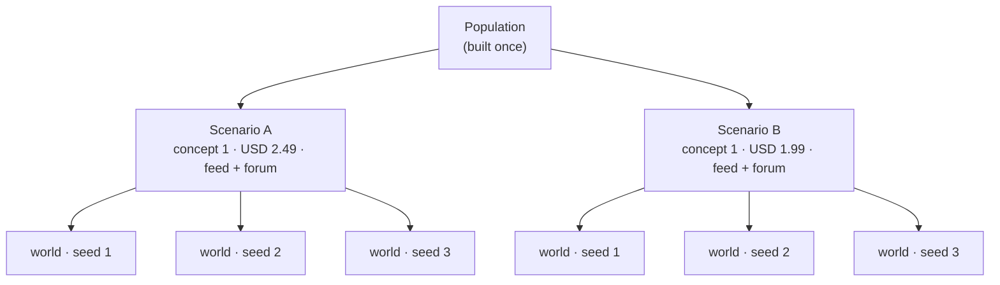

# Scenarios and worlds

One population can be tested under many conditions. A **scenario** describes one set of conditions; a
**world** is one run of a scenario. Running a scenario several times gives several worlds, and how much they
disagree is the study's estimate of its own noise.

## Variant and scenario

A **variant** is one version of the proposition: a concept, and which of the brief's claims it emphasises.
Price is *not* part of a variant, so one variant can be tested at several prices.

A **scenario** is a variant together with everything it faces:

| Field | Meaning | Default |
|---|---|---|
| `variant` | the concept and its emphasised claims | — |
| `price` | the price it is offered at, in the brief's currency | — |
| `audience_weights` | how audiences are weighted in results | the brief's shares |
| `tick_unit` | what one tick stands for: `hour`, `day` or `week` | — |
| `horizon_ticks` | how many ticks the world runs | — |
| `channels` | any of `social_feed`, `forum`, `wom`, or none | none |
| `survey_every` | ticks between survey waves | 1 |
| `exposure_budget` | stimuli one persona can be shown per channel per tick | 3 |
| `interventions` | `launch`, `teaser` or `promotion`, each at a tick | none |
| `launch_reach` | share told first-hand at launch, when word of mouth is the only channel | 0.10 |

A scenario describes conditions only. It holds no seed and says nothing about how many times it is run.

## Time is declared, not assumed

A tick is one step of simulated time, and its length is **declared** by the scenario, so an adoption curve
always has a stated unit and two studies are compared only when their units match. Memory decay and trend
windows are expressed relative to the horizon rather than in absolute ticks.

### Who acts on a tick

Not everyone acts every tick. Each persona's chance of taking a turn is its **involvement** times a
**rhythm** for the time of day or week, scaled by the run's current activation rate $a$ (1.0 unless the budget
has lowered it):

$$
P(\text{active at tick } t) = \min\big(1,\; \text{involvement} \times \text{rhythm}(t)\big) \times a
$$

The rhythm follows the tick unit: hourly ticks are quiet at night and peak at midday (0.08 at 3 a.m., 1.00 at
noon); daily ticks are full on weekdays and quieter at weekends (0.55 and 0.60); weekly ticks wake everyone.
Each persona then gets one seeded random draw per tick.

!!! example "Worked example"
    Hourly ticks, a persona with involvement 0.8, at tick 21 (9 p.m., rhythm 0.50), no budget pressure:
    $P = \min(1,\ 0.8 \times 0.50) \times 1.0 = 0.40$. At tick 12 (noon, rhythm 1.00) it would be 0.80.

### Survey waves

A [survey wave](measuring-intent.md) asks every persona the purchase question. With $k$ = `survey_every` and
$H$ = `horizon_ticks`, waves fall on

$$
\text{waves} = \{0, k, 2k, \dots\} \cup \{H - 1\}
$$

Tick 0 is always a wave (the baseline right after launch) and so is the last tick (the endpoint). For
example $k = 7$, $H = 30$ gives waves at ticks 0, 7, 14, 21, 28 and 29.

## Worlds and seeds

The run configuration lists **replicate seeds**. Each scenario is run once per seed, and each run is a world.
Two numbers are derived for every world ([ADR 0001](../adr/0001-derive-world-seed-from-replicate-and-variant.md),
[ADR 0005](../adr/0005-world-identity-derives-from-scenario-content.md)):

$$
\text{world seed} = \text{first 8 bytes of } \operatorname{SHA\text{-}256}(\text{replicate seed} : \text{variant id})
$$

$$
\text{world id} = \text{first 12 hex digits of } \operatorname{SHA\text{-}256}(\text{hash(scenario)} : \text{replicate seed} : \text{population hash})
$$

They are derived differently on purpose:

- The **seed** depends only on the replicate seed and the variant. So the same concept at two prices draws
  the *same* random numbers: the same personas wake on the same ticks. Any difference between them is the
  price, not luck. This is the classic *common random numbers* technique for comparing simulated
  alternatives.[^crn]
- The **id** covers the whole scenario. So the two price points are still two distinct worlds, and a run can
  tell "have I already run this cell?" from the id alone.

!!! example "Worked example"
    Variant `clear-v1`, replicate seed 7: SHA-256 of `"7:clear-v1"`, first 8 bytes read as an integer, gives
    world seed `4559272868482491478`. Seed 8 gives `13691069116212796920`. Every draw inside the world
    (activation, feed tie-breaks, word-of-mouth targets) is derived from this seed, the tick and a named
    purpose, so adding a new kind of draw can never shift an existing one.

## Replicate spread

How far a scenario's worlds disagree is its **replicate spread**: the population standard deviation of a
quantity across its $n$ seeds,

$$
\sigma = \sqrt{\frac{1}{n} \sum_{s=1}^{n} (x_s - \bar x)^2}
$$

!!! example "Worked example"
    Three seeds measure adoption 0.31, 0.27 and 0.35. The mean is 0.31 and $\sigma = 0.033$.

A single seed has a spread of exactly zero, reported as such, and a spread of zero is a yardstick that
measures nothing. A quantity that not every world measured has **no** spread: averaging only the worlds that
measured it would make seeds look in perfect agreement when the others never answered. The spread is what
[anomaly rules](results-and-trust.md#anomalies) are measured against.

## Sweeps

A **sweep** is one run over many scenarios and seeds sharing one budget: a grid of prices, a grid of
concepts, a grid of channel mixes. It is not a separate kind of thing from a run; it is a run with more worlds.

## Budget and degradation

A run has a budget. As spend grows, the runner lowers how fully worlds are simulated, by a fixed ladder
([ADR 0037](../adr/0037-a-budget-rung-belongs-to-the-run-and-is-replayed.md)):

| Spend / budget | Rung | Effect |
|---|---|---|
| ≥ 80% | warn | nothing changes yet |
| ≥ 95% | freeze tier B | optional frontier-model work stops: everything routes to the cheaper model |
| ≥ 100% | subsample | the activation rate drops to 0.40 |
| > 150% | pause | the run stops; completed worlds are kept and marked partial |

A rung belongs to the **run**, not one world, because worlds at different rungs are not comparable. Every rung
is recorded in each world's trace at the tick it took effect, and every report says which rungs a world ran
under. A **survey wave is never thinned**: a world pauses before a wave it cannot afford, so every wave it
recorded was answered by everyone.

[^crn]: A. M. Law (2015). *Simulation Modeling and Analysis*, 5th ed., McGraw-Hill, ch. 11 ("Variance-reduction
    techniques: common random numbers").
