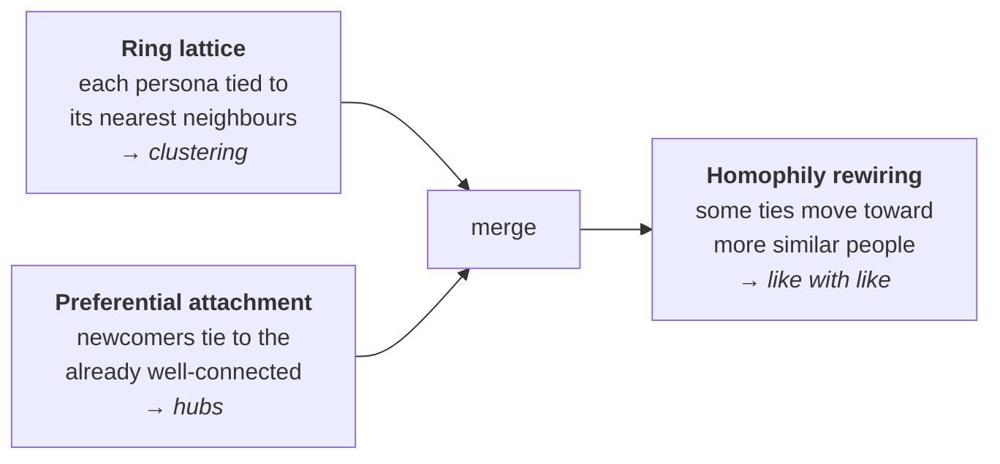

# The social network

People do not meet a product alone. They hear about it from friends, see what people like them are posting,
and argue in threads. So after the personas are drawn, Jahan ties them into a **social network**, generated
once per population and seeded so the same seed always gives the same network
([ADR 0019](../adr/0019-topology-is-generated-and-its-parameters-are-swept.md)).

The network matters in two places: [word of mouth](channels.md#word-of-mouth) only travels along its ties,
and the feed puts posts from a persona's ties first.

## How the network is built

Three layers, each supplying a property real social networks have:

1. **Ring lattice (clustering).** Personas are placed in a seeded random order around a ring, and each is tied
   to its 4 nearest neighbours (`ring_degree`). Friends of friends are then often friends, the high clustering
   of Watts and Strogatz's small-world model.[^ws] The order is shuffled first, so a neighbour on the ring
   says nothing about audience; otherwise communities would just rediscover the audiences.
2. **Preferential attachment (hubs).** A Barabási–Albert graph is merged in, each newcomer making 2 ties
   (`hub_attachment`) with a preference for personas that already have many.[^ba] This gives the long tail of
   highly connected people that real networks have.
3. **Homophily rewiring (similarity).** A share of ties (`homophily_strength`, default 30%) is reconsidered.
   For each, the better-connected end stays put, 16 random candidates are sampled, and the tie moves to the
   most similar candidate if they are more similar than the current partner. People tend to be tied to people
   like themselves.[^homophily] Hubs are never eroded, and no persona is ever left untied.

## Tie strength

Every tie carries a **strength** between 0 and 1: how similar the two personas are on the attributes they
both carry, weighted by the ontology's relevance order.

For attributes ranked $r = 0, 1, 2, \dots$ in the relevance order, the weight of rank $r$ is $w_r = 1/(r+1)$.
Over the attributes $A$ that both personas carry:

$$
s(a, b) = \frac{\sum_{r \in A} w_r \cdot \text{match}_r(a, b)}{\sum_{r \in A} w_r}
$$

where a categorical attribute matches 1 or 0, and an ordinal attribute matches by distance between band
midpoints $m$, scaled by the full span of the scale:

$$
\text{match}_r(a, b) = 1 - \frac{\lvert m_a - m_b \rvert}{m_{\max} - m_{\min}}
$$

Strengths are rounded to three decimals and never zero, so a tie always weighs something and two builds of
the same network hash identically.

!!! example "Worked example"
    Relevance order: `age`, `sex`, `exercise_frequency`, `diet_protein_focus`, with weights 1, ½, ⅓, ¼.
    Exercise frequency is ordinal with midpoints rarely = 0.25, weekly = 1.0, 3+ weekly = 4.0 (span 3.75).

    | attribute | weight | persona A | persona B | match |
    |---|---|---|---|---|
    | age | 1 | 25–34 | 25–34 | 1 |
    | sex | ½ | female | male | 0 |
    | exercise_frequency | ⅓ | 3+ weekly (4.0) | weekly (1.0) | $1 - 3/3.75 = 0.2$ |
    | diet_protein_focus | ¼ | high | *absent* | not counted |

    $$
    s = \frac{1 \cdot 1 + \tfrac12 \cdot 0 + \tfrac13 \cdot 0.2}{1 + \tfrac12 + \tfrac13} = \frac{1.0667}{1.8333} = 0.582
    $$

Strength is **attribute similarity, not an embedding**, on purpose: "tied because both train three times a
week" explains itself, where a cosine between two averaged vectors does not.

## Network gates

Like the sample, the network is checked before it is used, and a failure rejects the population:

| Check | Measured as | Passes at |
|---|---|---|
| Connected | share of personas in the largest connected component | ≥ 0.98 |
| Clustered | average clustering coefficient | ≥ 0.05 |
| Has hubs | highest degree ÷ mean degree | ≥ 1.8 |
| Not just the audiences | attribute assortativity of ties by audience[^newman] | < 0.9 |

The last check catches a network that merely restates the audiences: if almost every tie joins two members of
the same audience, communities found in it would only rediscover the brief. The measured assortativity of each
attribute is reported beside the gates, so how much attributes shaped the network is a number rather than an
assumption.

## Communities

A **community** is a cluster of personas the network ties closely together. Communities are **discovered**,
never declared: they appear only in results, never in a brief. Because they come from who is tied to whom,
they routinely cut across audiences, and that divergence is a finding, not a defect.

Jahan finds them with the **Leiden** algorithm[^leiden], which optimises modularity: how many more strong ties
fall inside communities than a random network with the same degrees would have. With $A_{ij}$ the tie strength
between $i$ and $j$, $k_i$ the total strength of $i$'s ties, $m$ the total strength of all ties, and
$\delta(c_i, c_j) = 1$ when $i$ and $j$ share a community:

$$
Q = \frac{1}{2m} \sum_{i,j} \left( A_{ij} - \gamma \frac{k_i k_j}{2m} \right) \delta(c_i, c_j)
$$

The resolution $\gamma$ trades few large communities against many small ones. Jahan runs Leiden, seeded, at
$\gamma \in \{0.5, 0.75, 1.0, 1.25, 1.5\}$ and keeps the partition with the **highest modularity** (scored at
$\gamma = 1$) among those that qualify:

- modularity $Q \ge 0.4$;
- between 4 and 8 communities;
- every community holds at least 5% of the population. A share rather than a count, so a small study is not
  structurally doomed.

A network with no qualifying partition is still valid. It simply has no communities, and **polarization**,
which compares communities, is then reported as *not measurable* rather than as zero.

## Every setting is recorded

Ring degree, hub attachment, homophily strength and every gate and community threshold are study parameters
with the defaults above. They are recorded on the population manifest and never read from the environment, so
a tuned network travels with the population that used it.

[^ws]: D. J. Watts and S. H. Strogatz (1998). "Collective dynamics of 'small-world' networks." *Nature*,
    393, 440–442.
[^ba]: A.-L. Barabási and R. Albert (1999). "Emergence of scaling in random networks." *Science*, 286(5439),
    509–512.
[^homophily]: M. McPherson, L. Smith-Lovin and J. M. Cook (2001). "Birds of a feather: homophily in social
    networks." *Annual Review of Sociology*, 27, 415–444.
[^newman]: M. E. J. Newman (2003). "Mixing patterns in networks." *Physical Review E*, 67, 026126.
[^leiden]: V. A. Traag, L. Waltman and N. J. van Eck (2019). "From Louvain to Leiden: guaranteeing
    well-connected communities." *Scientific Reports*, 9, 5233. Modularity: M. E. J. Newman and M. Girvan
    (2004). "Finding and evaluating community structure in networks." *Physical Review E*, 69, 026113.
    Resolution parameter: J. Reichardt and S. Bornholdt (2006). "Statistical mechanics of community
    detection." *Physical Review E*, 74, 016110.
