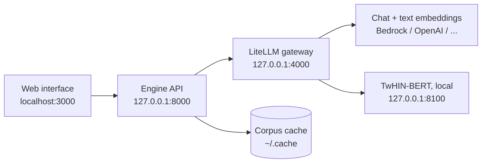

# Running the application end to end

How to run Jahan on your own machine: the engine, the LiteLLM gateway it talks
to, the locally served TwHIN-BERT ranking model, the persona corpus, and the web
interface. Follow it top to bottom on a fresh clone.



The engine speaks exactly one wire protocol — OpenAI Chat Completions and
Embeddings over HTTP — to one base URL you configure. It imports no provider
SDK and no gateway library; LiteLLM translates, vLLM and Ollama serve the
protocol directly[^adr21]. Retries, fallbacks and caching stay **off** on the
gateway: the engine owns all three, and only the engine writes the
trace[^m4plan].

## Platform notes

Commands are shown for bash/zsh and are identical on Linux and macOS (zsh is
the Mac default). `uv`, `git`, Node, `hf` and `litellm` all ship Windows
builds, so on Windows use PowerShell 7+ — or Git Bash/WSL, where the shown
commands work unchanged. Only these differ:

| Task | Linux / macOS (bash/zsh) | Windows (PowerShell) |
|---|---|---|
| Copy the env template (§4) | `cp .env.example .env` | `Copy-Item .env.example .env` |
| Load `.env` in each terminal (§4, §6) | `set -a; source .env; set +a` | `Get-Content .env \| Where-Object { $_ -notmatch '^\s*#' -and $_ -match '=' } \| ForEach-Object { $k,$v = $_ -split '=',2; Set-Item "env:$k" $v.Trim() }` |
| Cache dir lookup (§3) | `CACHE="$(uv run python -c '...')"` then `"$CACHE"` | `$env:CACHE = uv run python -c "..."` then `$env:CACHE` |
| Multi-line commands (§3, §5) | trailing `\` | trailing backtick `` ` ``, or collapse to one line |
| Chained commands (§6) | `cd frontend && npm install` | same on PS 7+; on PS 5.1 run them as two commands (`&&` needs PS 7+) |

Cache paths below read `~/.cache`; on Windows that is `%USERPROFILE%\.cache`
unless `XDG_CACHE_HOME` is set.

## 1. Prerequisites

- Python 3.12 or newer, managed with [uv](https://docs.astral.sh/uv/)
- Node.js 20+, only for the web interface
- The [Hugging Face CLI](https://huggingface.co/docs/huggingface_hub/guides/cli)
  (`hf`), for the corpus download
- A provider account behind the gateway (e.g. AWS credentials for Bedrock) —
  not needed until step 4, and never typed into the browser
- About 1.5 GB free for TwHIN-BERT weights, plus room for whichever corpus
  shards you fetch

## 2. Install the engine

```bash
git clone https://github.com/Tailorec/jahan.git
cd jahan
uv sync --extra web        # engine + HTTP API (FastAPI, uvicorn)
uv run pytest -q           # optional: the suite, no network and no keys
```

## 3. Fetch the persona corpus

The corpus is not in this repository. It is released for research only: you
download it and accept its terms yourself, and commercial studies need a
population you have the rights to[^readme]. The engine never downloads on your
behalf — a missing file raises with the exact command that fetches
it[^hf].

```bash
CACHE="$(uv run python -c 'from simcore.ports.hf import default_cache_dir; print(default_cache_dir())')"
hf download MatrAIx2026/MatrAIx_Persona_1M_Public_Release \
  --repo-type dataset --local-dir "$CACHE"
```

That is the whole release. To start small, fetch one shard instead — the
`--repo-type` and `--local-dir` flags stay the same, only the file pattern
changes:

```bash
hf download MatrAIx2026/MatrAIx_Persona_1M_Public_Release \
  "data/00004*.parquet" "manifest.json" "persona_codes.schema.json" \
  --repo-type dataset --local-dir "$CACHE"
```

Every cached file is verified against `manifest.json` each time it is opened,
so a truncated or substituted shard is refused rather than quietly
read[^hf]. A study that names shards or sources you have not fetched fails at
the gate with the fetch command, before it costs anything.

## 4. Put LiteLLM in front of your models

Install the proxy ([LiteLLM docs](https://docs.litellm.ai/docs/proxy/quick_start)):

```bash
pip install 'litellm[proxy]'   # cmd.exe: use double quotes
```

Then write `litellm.yaml`. The shape below is the documented default: chat and
text embeddings from your provider, TwHIN-BERT from your own laptop (step 5),
and the engine-owned policies switched off[^adr21][^m4plan]:

```yaml
model_list:
  - model_name: nova-micro          # chat: Bedrock example, use any provider
    litellm_params:
      model: bedrock/amazon.nova-micro-v1:0
      aws_region_name: us-east-1
  - model_name: titan-embed        # text embeddings beside the chat models
    litellm_params:
      model: bedrock/amazon.titan-embed-text-v2:0
      aws_region_name: us-east-1
  - model_name: twhin-bert-base    # the feed's ranking model, served locally
    litellm_params:
      model: openai/twhin-bert-base
      api_base: http://127.0.0.1:8100/v1
      api_key: dummy               # the local server checks no key

general_settings:
  num_retries: 0                   # the engine retries; the gateway translates
  fallbacks: []                    # a substituted model would silently break pins
cache:
  type: local
  mode: disabled                   # replay reads the trace, never a cache
```

Start it:

```bash
litellm --config litellm.yaml --port 4000
```

Point the engine at it in the `.env` file at the repository root — every
variable lives there, nothing is exported by hand. These are execution
settings, not study inputs: they change how fast a study runs, never which
world it records, so no hash covers them[^settings]:

```bash
cp .env.example .env
```

```dotenv
# .env — the only two lines a Bedrock setup needs to change:
SIMCORE_INFERENCE_BASE_URL=http://127.0.0.1:4000/v1
# SIMCORE_INFERENCE_API_KEY=sk-...   # only if your gateway needs a key;
                                     # Bedrock uses AWS credentials instead
```

Source it in each terminal before starting anything
(`set -a; source .env; set +a` — PowerShell in Platform notes). The file documents every variable in §8 with
its default. Keys stay server-side and are never typed into the browser.

!!! warning "Why AWS throttles without this"
    Bursts from concurrent runs hit provider rate limits. The salvage inventory
    records this pattern explicitly: a LiteLLM proxy used as one global
    rpm/tpm limiter for every concurrent run[^salvage]. Keep one gateway for
    all engine processes and set its request/token limits as the shared
    ceiling, then tune `SIMCORE_INFERENCE_CONCURRENCY`,
    `SIMCORE_INFERENCE_REQUESTS_PER_MINUTE` and
    `SIMCORE_INFERENCE_TOKENS_PER_MINUTE` below it.

## 5. Serve TwHIN-BERT locally (feed studies only)

The feed ranks like X: in-network posts first, then TwHIN-BERT similarity and
age[^readme]. TwHIN-BERT runs **outside** the engine as an OpenAI-compatible
`/v1/embeddings` server, so PyTorch never enters the engine's dependencies.
You only need it when a study ticks the social feed — without a pinned ranking
model the feed order is random, and survey-only studies skip this step
entirely.

```bash
uv run --no-project --with torch --with "transformers<5" \
  --index https://download.pytorch.org/whl/cpu \
  --index-strategy unsafe-best-match \
  python tools/twhin_server.py --port 8100
```

What this server is: `Twitter/twhin-bert-base`, tokenizer truncated at 512
tokens, vector is the model's `pooler_output` — computed exactly as OASIS
computes it. Two checkpoint quirks are handled inside: `transformers` stays
below 5 (v5 silently drops the `relative_key` position embeddings this
checkpoint needs), and the missing pooler weights are initialised from a fixed
seed so the same text embeds the same way on every start and a resumed feed
ranks as before[^twhin].

In the study the ranking model is pinned as `twhin-bert-base` (the interface's
`DEFAULT_RECSYS_MODEL`), routed by LiteLLM as `openai/twhin-bert-base`.

## 6. Start the engine API and the web interface

Two processes. The interface holds no engine logic — its `app/api/*` routes
are proxies to the engine API, so there is one path to every
number[^frontend]:

```bash
# every terminal first (PowerShell: see Platform notes):
set -a; source .env; set +a

# terminal 1 — the engine API
uv run --extra web python -m simcore.web --runs runs --port 8000

# terminal 2 — the interface (SIMCORE_WEB_URL already in .env)
cd frontend && npm install
npm run dev   # http://localhost:3000
```

`SIMCORE_WEB_URL` is the only thing the interface is configured with. The
inference endpoint, its key and its limits are the *server's* environment: the
Intake page reports whether an endpoint is configured (`GET /api/status`)
and never asks for, accepts or displays a key[^frontend].

!!! note "Naming"
    Some pages still say `jahan.web` and `JAHAN_WEB_URL` — the rename is
    docs-first and the code still reads `simcore.web` and `SIMCORE_WEB_URL`
    (`frontend/lib/server.ts`). Use the `SIMCORE_*` names until the code
    rename lands.

## 7. Run a study

**First, run fake.** No key, no corpus, no network — a real report in minutes,
marked as fake wherever it appears. In the interface: Intake → launch with
fake on. On the CLI:

```bash
uv run python -m simcore.cli concepts run <brief.yaml> --fake
```

**Then run real.** In the interface (Intake page):

1. Author the brief — product, claims with sources and evidence, price,
   competitors, audiences and shares, assumptions — and validate it. The
   assumption ledger is assembled from what the brief states and leaves
   unstated.
2. Pick what is cached: shards, sources and the population seed (`/api/corpus`
   tells the form what is there), plus the anchor scale version that passed
   its check (`/api/anchors`).
3. Pin the models a real run needs: chat model, embedding model, and
   `recsys_embed_model` when the feed is ticked. Declare prices — recorded
   costs come from the gateway, a declared price table, or stay unknown,
   never an estimate presented as a price.
4. Launch, watch ticks close and spend accrue against the budget on the Run
   page, and read the report when it completes. A cancelled run resumes with
   the same id; a run outlives a server restart.

A gate-only check without running anything:

```bash
uv run python -m simcore.cli coreset-gate --brief <brief.yaml>
```

## 8. Configuration reference

| Variable | Default | What it does |
|---|---|---|
| `SIMCORE_INFERENCE_BASE_URL` (`OPENAI_BASE_URL` also read) | `http://127.0.0.1:4000/v1` | The one gateway the engine talks to[^settings] |
| `SIMCORE_INFERENCE_API_KEY` (`OPENAI_API_KEY` also read) | — | Key for the gateway, if it needs one |
| `SIMCORE_INFERENCE_CONCURRENCY` | `32` | In-flight requests; lower it when throttled |
| `SIMCORE_INFERENCE_REQUESTS_PER_MINUTE` / `SIMCORE_INFERENCE_TOKENS_PER_MINUTE` | unset | Client-side ceilings under the gateway's shared limits |
| `SIMCORE_INFERENCE_TIMEOUT_S` / `MAX_RETRIES` / backoff / circuit | `90` / `3` / … | Timeouts and the engine-owned retry policy |
| `SIMCORE_INFERENCE_EMBEDDINGS_BATCH_SIZE` | `64` | Embedding batch width |
| `SIMCORE_EMBED_MODEL` | `amazon.titan-embed-text-v2:0` | Pinned text-embedding model for elicitation and search |
| `SIMCORE_CHAT_MODEL` | `amazon.nova-micro-v1:0` | Web default chat pin shown by `/api/status` |
| `SIMCORE_CACHE_DIR` / `XDG_CACHE_HOME` | `~/.cache` | Root for the inference cache and the corpus cache |
| `SIMCORE_WEB_URL` | `http://127.0.0.1:8000` | Where the interface finds the engine API |

Model pins, prices, temperatures and templates are study inputs — hashed into
the run — while everything in this table is execution configuration and
never is[^settings].

## 9. When something fails

| Symptom | Likely cause |
|---|---|
| `the shard … is needed but not cached; fetch it with: hf download …` | Study names shards/sources not yet fetched — run the named command (step 3) |
| `a study that ticks the social feed pins its ranking model` | Feed ticked without `recsys_embed_model` — start TwHIN-BERT (step 5) |
| `run a fake study, or set SIMCORE_INFERENCE_BASE_URL` | Gateway not reachable from where the server starts |
| 429 / throttling from AWS | Lower concurrency and rpm/tpm (step 4 warning); keep one shared gateway |
| A study reads `partial` after a restart | Its process died mid-run — resume it; orphans are swept on server start |
| A study says nothing was recorded | It died before writing — read `launch.log` in the run directory |

Worked real runs with their pins, prices and what broke are written up under
[Results so far](../research/results.md) — including the runs that failed.

[^adr21]: [ADR 0021](../adr/0021-the-engine-speaks-one-openai-compatible-endpoint.md) — one OpenAI-compatible endpoint, gateway retries/fallbacks/caching off.
[^m4plan]: `plans/m4-inference.md` — LiteLLM/vLLM/Ollama configurations, engine owns retries, fallbacks and caching.
[^readme]: [README](https://github.com/Tailorec/jahan#research-use-and-data) — research instrument; the corpus is downloaded, never bundled.
[^hf]: `simcore/ports/hf.py` — `fetch_command`, manifest verification on every open, `MissingShard`.
[^settings]: `simcore/inference/_settings.py` — `ExecutionSettings.from_environment`.
[^salvage]: [Salvage inventory](../SALVAGE.md) — LiteLLM proxy as the shared rpm/tpm limiter.
[^twhin]: `tools/twhin_server.py` — module docstring: OASIS `process_batch`, `transformers<5`, fixed pooler seed.
[^frontend]: `frontend/README.md` — proxy-only interface, `SIMCORE_WEB_URL`, key never in the browser.
