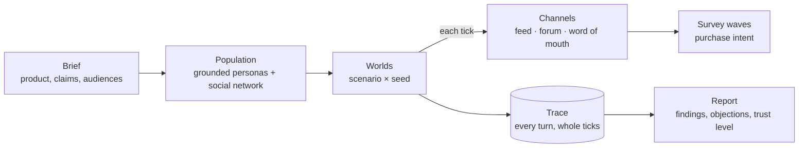

{ width="220" }

# Jahan

*Jahan* (جہان) is Urdu for **world**.

Jahan simulates how a population of people reacts to a product. Each person is an LLM persona grounded in a
real survey respondent. They live on a social network, see the product on an X-like feed, a Reddit-like
forum or by word of mouth, talk to each other, change their minds, and answer survey waves about whether
they would buy it.

Every number it reports can be traced back to the turns that produced it, and every turn's prompt can be
rebuilt from the record and checked against the hash taken when it ran.

!!! warning "A research instrument, not an oracle"
    Jahan is **uncalibrated**: no result has yet been checked against how real people behaved. Its own first
    holdout found that a model asked to fill in people's attitudes captures *relative* differences between
    groups but holds a biased overall picture, and loses to a plain demographic baseline
    ([results](research/results.md#holdout)). Read its numbers as what a simulation
    measured, never as facts about a market.

## How a study flows

## Where to go next

| You want to… | Read |
|---|---|
| Understand what a study is | [How a study works](concepts/index.md) |
| See the maths, with worked examples | [Population gates](concepts/population.md) · [Social network](concepts/social-network.md) · [Measuring intent](concepts/measuring-intent.md) · [Results](concepts/results-and-trust.md) |
| Know what it cannot tell you | [Limitations](concepts/limitations.md) |
| See what it has measured so far | [Results so far](research/results.md) |
| Install it | [Install](getting-started/install.md) |
| Run it end to end | [Running the application](getting-started/real-models.md) |
| Learn the words the engine uses | [Glossary](reference/glossary.md) |
| See why it works the way it does | [Decisions (ADRs)](adr/index.md) |

## License

Jahan is source-available under the [Functional Source License 1.1](https://fsl.software/) with an
Apache-2.0 future license: use it for anything — including your own commercial studies — except offering it,
or something substantially like it, as a competing product or service. Each release becomes Apache-2.0 two
years after it is published.
